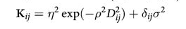
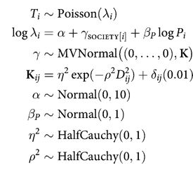
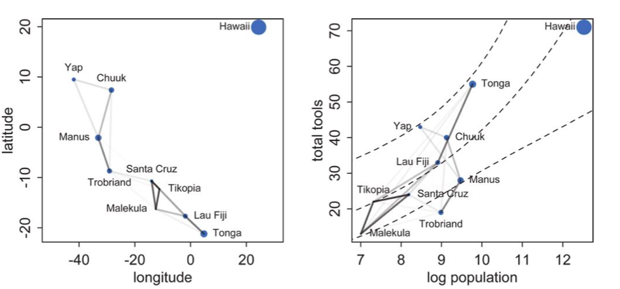

<!-- cell:1 type:code -->
```python
#| include: false

# /// script
# requires-python = ">=3.10"
# dependencies = [
#   "matplotlib",
#   "numpy",
#   "pandas",
#   "pymc",
#   "scipy",
#   "seaborn",
# ]
# ///

```

<!-- cell:2 type:markdown -->
We read back the Oceanic tools data with geographic coordinates and a distance matrix to model spatial correlation between island societies using a Gaussian Process covariance structure.

<!-- cell:3 type:code -->
```python
%matplotlib inline
import numpy as np
import scipy as sp
import matplotlib as mpl
import matplotlib.cm as cm
import matplotlib.pyplot as plt
import pandas as pd
pd.set_option('display.width', 500)
pd.set_option('display.max_columns', 100)
pd.set_option('display.notebook_repr_html', True)
import seaborn as sns
sns.set_style("whitegrid")
sns.set_context("poster")
import pymc as pm
import arviz as az
```

<!-- cell:4 type:markdown -->
## Reading in our data

We read back the Oceanic tools data

<!-- cell:5 type:code -->
```python
df = pd.read_csv("data/Kline2.csv", sep=';')
df.head()
```
Output:
```
      culture  population contact  total_tools  mean_TU   lat    lon  lon2    logpop
0    Malekula        1100     low           13      3.2 -16.3  167.5 -12.5  7.003065
1     Tikopia        1500     low           22      4.7 -12.3  168.8 -11.2  7.313220
2  Santa Cruz        3600     low           24      4.0 -10.7  166.0 -14.0  8.188689
3         Yap        4791    high           43      5.0   9.5  138.1 -41.9  8.474494
4    Lau Fiji        7400    high           33      5.0 -17.7  178.1  -1.9  8.909235
```

<!-- cell:6 type:markdown -->
And center it

<!-- cell:7 type:code -->
```python
df['logpop_c'] = df.logpop - df.logpop.mean()
```

<!-- cell:8 type:code -->
```python
df.head()
```
Output:
```
      culture  population contact  total_tools  mean_TU   lat    lon  lon2    logpop  logpop_c
0    Malekula        1100     low           13      3.2 -16.3  167.5 -12.5  7.003065 -1.973939
1     Tikopia        1500     low           22      4.7 -12.3  168.8 -11.2  7.313220 -1.663784
2  Santa Cruz        3600     low           24      4.0 -10.7  166.0 -14.0  8.188689 -0.788316
3         Yap        4791    high           43      5.0   9.5  138.1 -41.9  8.474494 -0.502510
4    Lau Fiji        7400    high           33      5.0 -17.7  178.1  -1.9  8.909235 -0.067769
```

<!-- cell:9 type:markdown -->
And read in the distance matrix

<!-- cell:10 type:code -->
```python
dfd = pd.read_csv("data/distmatrix.csv", header=None)
dij=dfd.values
dij
```
Output:
```
array([[0.   , 0.475, 0.631, 4.363, 1.234, 2.036, 3.178, 2.794, 1.86 ,
        5.678],
       [0.475, 0.   , 0.315, 4.173, 1.236, 2.007, 2.877, 2.67 , 1.965,
        5.283],
       [0.631, 0.315, 0.   , 3.859, 1.55 , 1.708, 2.588, 2.356, 2.279,
        5.401],
       [4.363, 4.173, 3.859, 0.   , 5.391, 2.462, 1.555, 1.616, 6.136,
        7.178],
       [1.234, 1.236, 1.55 , 5.391, 0.   , 3.219, 4.027, 3.906, 0.763,
        4.884],
       [2.036, 2.007, 1.708, 2.462, 3.219, 0.   , 1.801, 0.85 , 3.893,
        6.653],
       [3.178, 2.877, 2.588, 1.555, 4.027, 1.801, 0.   , 1.213, 4.789,
        5.787],
       [2.794, 2.67 , 2.356, 1.616, 3.906, 0.85 , 1.213, 0.   , 4.622,
        6.722],
       [1.86 , 1.965, 2.279, 6.136, 0.763, 3.893, 4.789, 4.622, 0.   ,
        5.037],
       [5.678, 5.283, 5.401, 7.178, 4.884, 6.653, 5.787, 6.722, 5.037,
        0.   ]])
```

<!-- cell:11 type:markdown -->
## Implementing the simple tools:logpop model and varying intercepts models

<!-- cell:12 type:code -->
```python
import pytensor.tensor as pt
```

<!-- cell:13 type:code -->
```python
with pm.Model() as m2c_onlyp:
    betap = pm.Normal("betap", 0, 1)
    alpha = pm.Normal("alpha", 0, 10)
    loglam = alpha + betap*df.logpop_c
    y = pm.Poisson("ntools", mu=pt.exp(loglam), observed=df.total_tools)
    trace2c_onlyp = pm.sample(6000, tune=1000)
```
Output:
```
Initializing NUTS using jitter+adapt_diag...
```
Output:
```
Multiprocess sampling (4 chains in 4 jobs)
```
Output:
```
NUTS: [betap, alpha]
```
Output:
```
/Users/rahul/Library/Caches/uv/archive-v0/aTiHGxSE8gD8G3bEQyxJO/lib/python3.14/site-packages/rich/live.py:260: 
UserWarning: install "ipywidgets" for Jupyter support
  warnings.warn('install "ipywidgets" for Jupyter support')
```
Output:
```
Sampling 4 chains for 1_000 tune and 6_000 draw iterations (4_000 + 24_000 draws total) took 2 seconds.
```

<!-- cell:14 type:code -->
```python
az.summary(trace2c_onlyp)
```
Output:
```
        mean     sd  hdi_3%  hdi_97%  mcse_mean  mcse_sd  ess_bulk  ess_tail  r_hat
betap  0.239  0.031   0.179    0.297        0.0      0.0   20521.0   16397.0    1.0
alpha  3.478  0.058   3.372    3.588        0.0      0.0   20922.0   16520.0    1.0
```

<!-- cell:15 type:markdown -->
Notice that $\beta_P$ has a value around 0.24

We also implement the varying intercepts per society model from before

<!-- cell:16 type:code -->
```python
with pm.Model() as m3c:
    betap = pm.Normal("betap", 0, 1)
    alpha = pm.Normal("alpha", 0, 10)
    sigmasoc = pm.HalfCauchy("sigmasoc", 1)
    alphasoc = pm.Normal("alphasoc", 0, sigmasoc, shape=df.shape[0])
    loglam = alpha + alphasoc + betap*df.logpop_c 
    y = pm.Poisson("ntools", mu=pt.exp(loglam), observed=df.total_tools)
with m3c:
    trace3 = pm.sample(6000, tune=1000, target_accept=0.95)
```
Output:
```
Initializing NUTS using jitter+adapt_diag...
```
Output:
```
Multiprocess sampling (4 chains in 4 jobs)
```
Output:
```
NUTS: [betap, alpha, sigmasoc, alphasoc]
```
Output:
```
/Users/rahul/Library/Caches/uv/archive-v0/aTiHGxSE8gD8G3bEQyxJO/lib/python3.14/site-packages/rich/live.py:260: 
UserWarning: install "ipywidgets" for Jupyter support
  warnings.warn('install "ipywidgets" for Jupyter support')
```
Output:
```
Sampling 4 chains for 1_000 tune and 6_000 draw iterations (4_000 + 24_000 draws total) took 5 seconds.
```
Output:
```
There were 10 divergences after tuning. Increase `target_accept` or reparameterize.
```

<!-- cell:17 type:code -->
```python
az.summary(trace3)
```
Output:
```
              mean     sd  hdi_3%  hdi_97%  mcse_mean  mcse_sd  ess_bulk  ess_tail  r_hat
betap        0.261  0.081   0.107    0.416      0.001    0.001    9947.0    9891.0    1.0
alpha        3.443  0.120   3.211    3.667      0.001    0.001    7646.0    8098.0    1.0
alphasoc[0] -0.201  0.241  -0.665    0.243      0.002    0.002   12562.0   11942.0    1.0
alphasoc[1]  0.042  0.221  -0.367    0.478      0.002    0.002   11734.0   10870.0    1.0
alphasoc[2] -0.048  0.195  -0.418    0.331      0.002    0.002   12818.0   12931.0    1.0
alphasoc[3]  0.325  0.189  -0.025    0.678      0.002    0.002    7467.0    9482.0    1.0
alphasoc[4]  0.044  0.176  -0.281    0.391      0.002    0.001   12480.0   11816.0    1.0
alphasoc[5] -0.317  0.208  -0.713    0.049      0.002    0.002   11430.0   12974.0    1.0
alphasoc[6]  0.145  0.171  -0.169    0.478      0.002    0.001   11496.0   11783.0    1.0
alphasoc[7] -0.171  0.182  -0.533    0.151      0.002    0.001   12357.0   13019.0    1.0
alphasoc[8]  0.274  0.175  -0.042    0.613      0.002    0.001    9749.0   10910.0    1.0
alphasoc[9] -0.093  0.288  -0.651    0.458      0.003    0.003   10202.0    9662.0    1.0
sigmasoc     0.308  0.127   0.087    0.545      0.002    0.001    4838.0    3874.0    1.0
```

<!-- cell:18 type:markdown -->
## A model with a custom covariance matrix

The assumption here now is that the intercepts for these various societies are correlated...

We use a custom covariance matrix which inverse-square weights distance



You have seen this before! This is an example of a Gaussian Process Covariance Matrix. 

Here is the complete model:



<!-- cell:19 type:code -->
```python
with pm.Model() as mgc:
    betap = pm.Normal("betap", 0, 1)
    alpha = pm.Normal("alpha", 0, 10)
    etasq = pm.HalfCauchy("etasq", 1)
    rhosq = pm.HalfCauchy("rhosq", 1)
    means = pt.stack([0.0]*10)
    sigma_matrix = pt.diag(pt.as_tensor_variable([0.01]*10))
    cov = pt.exp(-rhosq*dij*dij)*etasq + sigma_matrix
    gammasoc = pm.MvNormal("gammasoc", means, cov=cov, shape=df.shape[0])
    loglam = alpha + gammasoc + betap*df.logpop_c 
    y = pm.Poisson("ntools", mu=pt.exp(loglam), observed=df.total_tools)
```

<!-- cell:20 type:code -->
```python
with mgc:
    mgctrace = pm.sample(10000, tune=2000, target_accept=0.95)
```
Output:
```
Initializing NUTS using jitter+adapt_diag...
```
Output:
```
Multiprocess sampling (4 chains in 4 jobs)
```
Output:
```
NUTS: [betap, alpha, etasq, rhosq, gammasoc]
```
Output:
```
/Users/rahul/Library/Caches/uv/archive-v0/aTiHGxSE8gD8G3bEQyxJO/lib/python3.14/site-packages/rich/live.py:260: 
UserWarning: install "ipywidgets" for Jupyter support
  warnings.warn('install "ipywidgets" for Jupyter support')
```
Output:
```
Sampling 4 chains for 2_000 tune and 10_000 draw iterations (8_000 + 40_000 draws total) took 42 seconds.
```

<!-- cell:21 type:code -->
```python
az.summary(mgctrace)
```
Output:
```
              mean      sd  hdi_3%  hdi_97%  mcse_mean  mcse_sd  ess_bulk  ess_tail  r_hat
betap        0.246   0.115   0.028    0.469      0.001    0.001   10228.0   11850.0    1.0
alpha        3.509   0.354   2.861    4.149      0.006    0.013    4779.0    3911.0    1.0
gammasoc[0] -0.268   0.455  -1.121    0.549      0.007    0.012    5484.0    4869.0    1.0
gammasoc[1] -0.120   0.443  -0.968    0.670      0.007    0.012    5099.0    4180.0    1.0
gammasoc[2] -0.164   0.428  -0.982    0.587      0.007    0.012    5138.0    4151.0    1.0
gammasoc[3]  0.300   0.385  -0.414    0.991      0.006    0.012    5388.0    4369.0    1.0
gammasoc[4]  0.032   0.379  -0.660    0.720      0.006    0.013    5340.0    4222.0    1.0
gammasoc[5] -0.454   0.388  -1.163    0.214      0.006    0.012    5582.0    4762.0    1.0
gammasoc[6]  0.102   0.374  -0.585    0.773      0.006    0.013    5442.0    4361.0    1.0
gammasoc[7] -0.258   0.376  -0.952    0.402      0.006    0.013    5448.0    4625.0    1.0
gammasoc[8]  0.239   0.357  -0.391    0.908      0.005    0.013    5642.0    4511.0    1.0
gammasoc[9] -0.115   0.460  -0.978    0.770      0.005    0.009    8816.0    8235.0    1.0
etasq        0.352   0.590   0.000    1.007      0.007    0.058    6572.0    9485.0    1.0
rhosq        2.028  61.589   0.002    3.745      0.361   28.788    7949.0   11599.0    1.0
```

<!-- cell:22 type:code -->
```python
az.plot_trace(mgctrace);
```


<!-- cell:23 type:code -->
```python
az.plot_autocorr(mgctrace);
```
Output:
```
/Users/rahul/Library/Caches/uv/archive-v0/aTiHGxSE8gD8G3bEQyxJO/lib/python3.14/site-packages/arviz/plots/plot_utils.py:270: UserWarning: rcParams['plot.max_subplots'] (40) is smaller than the number of variables to plot (56) in plot_autocorr, generating only 40 plots
  warnings.warn(
```


<!-- cell:24 type:code -->
```python
d={}
gammasoc_samples = mgctrace.posterior['gammasoc'].values.reshape(-1, 10)
for i, v in enumerate(df.culture.values):
    d[v] = gammasoc_samples[:,i]
dfsamps=pd.DataFrame.from_dict(d)
dfsamps.head()
```
Output:
```
   Malekula   Tikopia  Santa Cruz       Yap  Lau Fiji  Trobriand     Chuuk     Manus     Tonga    Hawaii
0 -0.130590  0.089298   -0.181058  0.615596  0.044638   0.310527  0.318529  0.011540  0.522527  0.314769
1 -0.086934  0.260856   -0.154601  0.322845  0.349256  -0.795153  0.188721 -0.294910  0.368426 -0.112205
2 -0.032733 -0.008312    0.203633  0.255771  0.592531  -0.736068  0.244687 -0.314360  0.449234 -0.123681
3 -0.103811 -0.273942    0.047349  0.704714  0.157025  -0.358446  0.295830  0.189327  0.385959  0.165699
4 -0.138728  0.030216   -0.301498  0.259886  0.256591  -0.179903  0.237708 -0.223339  0.380631  0.238701
```

<!-- cell:25 type:code -->
```python
dfsamps.describe()
```
Output:
```
           Malekula       Tikopia    Santa Cruz           Yap      Lau Fiji     Trobriand         Chuuk         Manus         Tonga        Hawaii
count  40000.000000  40000.000000  40000.000000  40000.000000  40000.000000  40000.000000  40000.000000  40000.000000  40000.000000  40000.000000
mean      -0.267976     -0.119667     -0.164049      0.300261      0.031830     -0.453667      0.102345     -0.257916      0.238663     -0.115166
std        0.455163      0.443377      0.427740      0.384622      0.378590      0.388457      0.373908      0.376287      0.356762      0.459638
min       -5.289634     -4.423674     -4.465862     -3.658895     -3.881839     -4.573565     -3.968056     -4.391581     -3.535199     -4.035076
25%       -0.494601     -0.337898     -0.363096      0.115944     -0.143074     -0.637728     -0.066815     -0.431598      0.076133     -0.363911
50%       -0.236810     -0.093558     -0.132354      0.309491      0.046415     -0.418354      0.116564     -0.231101      0.248910     -0.108310
75%       -0.008959      0.128550      0.076217      0.503830      0.229287     -0.231597      0.297074     -0.055373      0.422726      0.138756
max        3.642086      3.495336      3.480449      3.841792      3.590994      2.914655      3.495762      3.064075      3.666528      3.068279
```

<!-- cell:26 type:markdown -->
## Plotting posteriors and predictives

Lets plot the covariance posteriors for the 100 random samples in the trace.

<!-- cell:27 type:code -->
```python
smalleta=np.random.choice(mgctrace.posterior['etasq'].values.flatten(), replace=False, size=100)
smallrho=np.random.choice(mgctrace.posterior['rhosq'].values.flatten(), replace=False, size=100)
```

<!-- cell:28 type:code -->
```python
with sns.plotting_context('poster'):
    d=np.linspace(0,10,100)
    for i in range(100):
        covarod = lambda d: smalleta[i]*np.exp(-smallrho[i]*d*d)
        plt.plot(d, covarod(d),alpha=0.1, color='k')
    medetasq=np.median(mgctrace.posterior['etasq'].values.flatten())
    medrhosq=np.median(mgctrace.posterior['rhosq'].values.flatten())
    covarodmed = lambda d: medetasq*np.exp(-medrhosq*d*d)
    plt.plot(d, covarodmed(d),alpha=1.0, color='k', lw=3)
    plt.ylim([0,1]); 
```


<!-- cell:29 type:markdown -->
The x-axis is thousands of kilometers. Notice how almost everything damps out by 4000 kms. Lets calculate the median correlation matrix:

<!-- cell:30 type:code -->
```python
medkij = np.diag([0.01]*10)+medetasq*(np.exp(-medrhosq*dij*dij))
```

<!-- cell:31 type:code -->
```python
#from statsmodels
def cov2corr(cov, return_std=False):
    '''convert covariance matrix to correlation matrix

    Parameters
    ----------
    cov : array_like, 2d
        covariance matrix, see Notes

    Returns
    -------
    corr : ndarray (subclass)
        correlation matrix
    return_std : bool
        If this is true then the standard deviation is also returned.
        By default only the correlation matrix is returned.

    Notes
    -----
    This function does not convert subclasses of ndarrays. This requires
    that division is defined elementwise. np.ma.array and np.matrix are allowed.

    '''
    cov = np.asanyarray(cov)
    std_ = np.sqrt(np.diag(cov))
    corr = cov / np.outer(std_, std_)
    if return_std:
        return corr, std_
    else:
        return corr
```

<!-- cell:32 type:code -->
```python
medcorrij=cov2corr(medkij)
medcorrij
```
Output:
```
array([[1.00000000e+00, 8.69835262e-01, 8.11247323e-01, 4.34367364e-04,
        5.14947515e-01, 1.78423268e-01, 1.60816245e-02, 4.06297035e-02,
        2.35399591e-01, 2.09068998e-06],
       [8.69835262e-01, 1.00000000e+00, 9.15425265e-01, 8.36612901e-04,
        5.13920440e-01, 1.87081494e-01, 3.35913172e-02, 5.34275935e-02,
        2.00129903e-01, 1.20288892e-05],
       [8.11247323e-01, 9.15425265e-01, 1.00000000e+00, 2.31844903e-03,
        3.60868694e-01, 2.93087429e-01, 6.35978815e-02, 1.01103669e-01,
        1.16791052e-01, 7.22676264e-06],
       [4.34367364e-04, 8.36612901e-04, 2.31844903e-03, 1.00000000e+00,
        7.54894121e-06, 8.22482782e-02, 3.58611523e-01, 3.31644646e-01,
        2.34734649e-07, 8.62061048e-10],
       [5.14947515e-01, 5.13920440e-01, 3.60868694e-01, 7.54894121e-06,
        1.00000000e+00, 1.44642105e-02, 1.35724605e-03, 2.00050756e-03,
        7.53105751e-01, 6.19798877e-05],
       [1.78423268e-01, 1.87081494e-01, 2.93087429e-01, 8.22482782e-02,
        1.44642105e-02, 1.00000000e+00, 2.56872798e-01, 7.11581900e-01,
        2.08418262e-03, 1.62198197e-08],
       [1.60816245e-02, 3.35913172e-02, 6.35978815e-02, 3.58611523e-01,
        1.35724605e-03, 2.56872798e-01, 1.00000000e+00, 5.25753868e-01,
        8.98552376e-05, 1.26166302e-06],
       [4.06297035e-02, 5.34275935e-02, 1.01103669e-01, 3.31644646e-01,
        2.00050756e-03, 7.11581900e-01, 5.25753868e-01, 1.00000000e+00,
        1.69589545e-04, 1.11702234e-08],
       [2.35399591e-01, 2.00129903e-01, 1.16791052e-01, 2.34734649e-07,
        7.53105751e-01, 2.08418262e-03, 8.98552376e-05, 1.69589545e-04,
        1.00000000e+00, 3.35602210e-05],
       [2.09068998e-06, 1.20288892e-05, 7.22676264e-06, 8.62061048e-10,
        6.19798877e-05, 1.62198197e-08, 1.26166302e-06, 1.11702234e-08,
        3.35602210e-05, 1.00000000e+00]])
```

<!-- cell:33 type:markdown -->
We'll data frame it to see clearly

<!-- cell:34 type:code -->
```python
dfcorr = pd.DataFrame(medcorrij*100)
dfcorr.index = df.culture.tolist()
dfcorr.columns = df.culture.tolist()
dfcorr
```
Output:
```
              Malekula     Tikopia  Santa Cruz           Yap    Lau Fiji   Trobriand       Chuuk       Manus       Tonga        Hawaii
Malekula    100.000000   86.983526   81.124732  4.343674e-02   51.494751   17.842327    1.608162    4.062970   23.539959  2.090690e-04
Tikopia      86.983526  100.000000   91.542526  8.366129e-02   51.392044   18.708149    3.359132    5.342759   20.012990  1.202889e-03
Santa Cruz   81.124732   91.542526  100.000000  2.318449e-01   36.086869   29.308743    6.359788   10.110367   11.679105  7.226763e-04
Yap           0.043437    0.083661    0.231845  1.000000e+02    0.000755    8.224828   35.861152   33.164465    0.000023  8.620610e-08
Lau Fiji     51.494751   51.392044   36.086869  7.548941e-04  100.000000    1.446421    0.135725    0.200051   75.310575  6.197989e-03
Trobriand    17.842327   18.708149   29.308743  8.224828e+00    1.446421  100.000000   25.687280   71.158190    0.208418  1.621982e-06
Chuuk         1.608162    3.359132    6.359788  3.586115e+01    0.135725   25.687280  100.000000   52.575387    0.008986  1.261663e-04
Manus         4.062970    5.342759   10.110367  3.316446e+01    0.200051   71.158190   52.575387  100.000000    0.016959  1.117022e-06
Tonga        23.539959   20.012990   11.679105  2.347346e-05   75.310575    0.208418    0.008986    0.016959  100.000000  3.356022e-03
Hawaii        0.000209    0.001203    0.000723  8.620610e-08    0.006198    0.000002    0.000126    0.000001    0.003356  1.000000e+02
```

<!-- cell:35 type:markdown -->
Notice how there is correlation in the upper left and with Manus and Trobriand. Mcelreath has a distance plot i reproduce below:

<!-- cell:36 type:markdown -->


<!-- cell:37 type:markdown -->
To produce a plot like the one on the right, we calculate the posterior predictives with the correlation free part of the model and then overlay the correlations

<!-- cell:38 type:code -->
```python
from scipy.stats import poisson
def compute_pp_no_corr(lpgrid, idata, contact=0):
    alphatrace = idata.posterior['alpha'].values.flatten()
    betaptrace = idata.posterior['betap'].values.flatten()
    tl=len(alphatrace)
    gl=lpgrid.shape[0]
    lam = np.empty((gl, tl))
    lpgrid = lpgrid - lpgrid.mean()
    for i, v in enumerate(lpgrid):
        temp = alphatrace + betaptrace*lpgrid[i]
        lam[i,:] = poisson.rvs(np.exp(temp))
    return lam
```

<!-- cell:39 type:code -->
```python
lpgrid = np.linspace(6,13,30)
pp = compute_pp_no_corr(lpgrid, mgctrace)
ppmed = np.median(pp, axis=1)
pphpd = az.hdi(pp.T)
```
Output:
```
/var/folders/wq/mr3zj9r14dzgjnq9rjx_vqbc0000gn/T/ipykernel_99733/1140317622.py:4: FutureWarning: hdi currently interprets 2d data as (draw, shape) but this will change in a future release to (chain, draw) for coherence with other functions
  pphpd = az.hdi(pp.T)
```

<!-- cell:40 type:code -->
```python
import itertools
corrs={}
for i, j in itertools.product(range(10), range(10)):
    if i <j:
        corrs[(i,j)]=medcorrij[i,j]
corrs
```
Output:
```
{(0, 1): np.float64(0.8698352620543791),
 (0, 2): np.float64(0.8112473227705732),
 (0, 3): np.float64(0.00043436736396140004),
 (0, 4): np.float64(0.5149475145540022),
 (0, 5): np.float64(0.1784232683108405),
 (0, 6): np.float64(0.016081624526447357),
 (0, 7): np.float64(0.04062970353128279),
 (0, 8): np.float64(0.23539959071681077),
 (0, 9): np.float64(2.0906899790788574e-06),
 (1, 2): np.float64(0.9154252648017558),
 (1, 3): np.float64(0.0008366129005128546),
 (1, 4): np.float64(0.5139204403538437),
 (1, 5): np.float64(0.18708149396439477),
 (1, 6): np.float64(0.03359131718569693),
 (1, 7): np.float64(0.053427593503310396),
 (1, 8): np.float64(0.20012990301592104),
 (1, 9): np.float64(1.202888923895069e-05),
 (2, 3): np.float64(0.0023184490292404336),
 (2, 4): np.float64(0.3608686936824079),
 (2, 5): np.float64(0.29308742903236046),
 (2, 6): np.float64(0.06359788152183848),
 (2, 7): np.float64(0.10110366922210785),
 (2, 8): np.float64(0.11679105204171875),
 (2, 9): np.float64(7.2267626429193134e-06),
 (3, 4): np.float64(7.5489412116086325e-06),
 (3, 5): np.float64(0.08224827819593294),
 (3, 6): np.float64(0.35861152292486287),
 (3, 7): np.float64(0.33164464636786223),
 (3, 8): np.float64(2.347346485820119e-07),
 (3, 9): np.float64(8.620610481644896e-10),
 (4, 5): np.float64(0.014464210496029285),
 (4, 6): np.float64(0.0013572460520712762),
 (4, 7): np.float64(0.002000507564221195),
 (4, 8): np.float64(0.7531057509569615),
 (4, 9): np.float64(6.197988773284955e-05),
 (5, 6): np.float64(0.25687279780700056),
 (5, 7): np.float64(0.7115819000189696),
 (5, 8): np.float64(0.0020841826197110433),
 (5, 9): np.float64(1.621981972350849e-08),
 (6, 7): np.float64(0.5257538678112668),
 (6, 8): np.float64(8.985523762623615e-05),
 (6, 9): np.float64(1.2616630242151445e-06),
 (7, 8): np.float64(0.00016958954461546093),
 (7, 9): np.float64(1.1170223361457242e-08),
 (8, 9): np.float64(3.3560220950963584e-05)}
```

<!-- cell:41 type:code -->
```python
with sns.plotting_context('poster'):
    plt.plot(df.logpop, df.total_tools,'o', color="g")
    lpv = df.logpop.values
    ttv = df.total_tools.values
    for a,x,y in zip(df.culture.values, lpv, ttv):
        plt.annotate(a, xy=(x,y))
    for i in range(10):
        for j in range(10):
            if i < j:
                plt.plot([lpv[i],lpv[j]],[ttv[i], ttv[j]],'k', alpha=corrs[(i,j)]/1.)
    plt.plot(lpgrid, ppmed, color="g")
    plt.fill_between(lpgrid, pphpd[:,0], pphpd[:,1], color="g", alpha=0.2, lw=1)
    plt.ylim([10, 75])
    plt.xlim([6.5, 13])
```


<!-- cell:42 type:markdown -->
Notice how distance probably pulls Fiji up from the median, and how Manus and Trobriand are below the median but highly correlated. A smaller effect can be seen with the triangle on the left. Of-course, causality is uncertain
