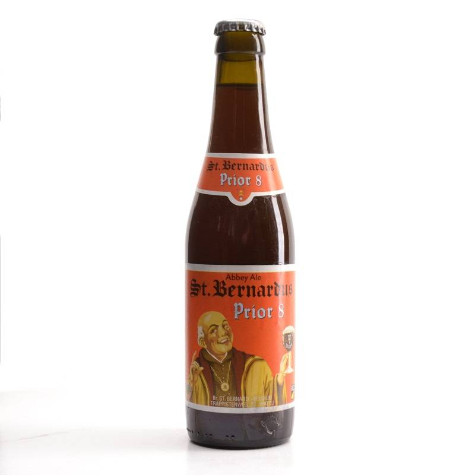
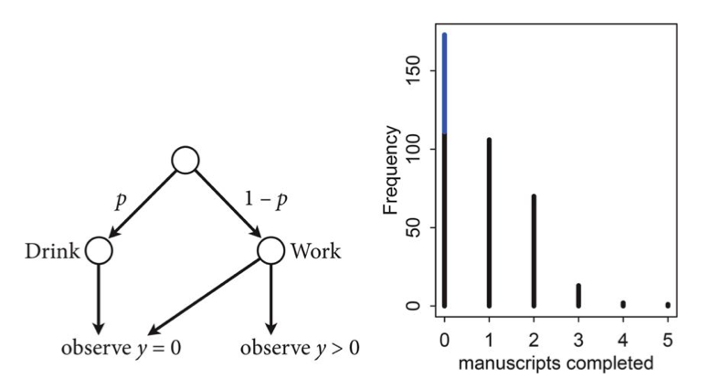

<!-- cell:1 type:code -->
```python
#| include: false

# /// script
# requires-python = ">=3.10"
# dependencies = [
#   "matplotlib",
#   "numpy",
#   "pandas",
#   "pymc",
#   "scipy",
#   "seaborn",
# ]
# ///

```

<!-- cell:2 type:code -->
```python
%matplotlib inline
import numpy as np
import scipy as sp
import matplotlib as mpl
import matplotlib.cm as cm
import matplotlib.pyplot as plt
import pandas as pd
pd.set_option('display.width', 500)
pd.set_option('display.max_columns', 100)
pd.set_option('display.notebook_repr_html', True)
import seaborn as sns
sns.set_style("whitegrid")
sns.set_context("poster")
import pymc as pm
import arviz as az
```

<!-- cell:3 type:markdown -->
## Monks working on manuscripts

<!-- cell:4 type:markdown -->
From McElreath:

>Now imagine that the monks take breaks on some days. On those days, no manuscripts are completed. Instead, the wine cellar is opened and more earthly delights are practiced. As the monastery owner, you'd like to know how often the monks drink. The obstacle for inference is that there will be zeros on honest non-drinking days, as well, just by chance. So how can you estimate the number of days spent drinking?



The kind of model used to solve this problem is called a **Mixture Model**. We'll see these in more detail next week, but here is a simple version that arises in Poisson regression.

Let $p$ be the probability that the monks spend the day drinking, and $\lambda$ be the mean number of manuscripts completed, when they work.


<!-- cell:5 type:markdown -->
### Likelihood

<!-- cell:6 type:markdown -->
The likelihood of observing 0 manuscripts produced is is:

 $$\cal{L}(y=0) = p + (1-p) e^{-\lambda},$$

since the Poisson likelihood of $y$ is $ \lambda^y exp(–\lambda)/y!$

<!-- cell:7 type:markdown -->
Likelihood of a non-zero $y$ is:

 $$\cal{L}(y \ne 0) = (1-p) \frac{\lambda^y e^{-\lambda}}{y!}$$

This model can be described by this diagram, taken from Mc-Elreath




<!-- cell:8 type:markdown -->
### Generating the data

We're throwing bernoullis for whether a given day in the year is a drinking day or not...

<!-- cell:9 type:code -->
```python
from scipy.stats import binom
p_drink=0.2
rate_work=1
N=365
drink=binom.rvs(n=1, p=p_drink, size=N)
drink
```
Output:
```
array([0, 0, 0, 0, 0, 1, 0, 0, 0, 0, 0, 1, 0, 0, 0, 0, 0, 1, 0, 0, 0, 0,
       0, 0, 0, 0, 0, 0, 1, 0, 0, 0, 0, 1, 0, 0, 1, 0, 0, 0, 1, 0, 0, 1,
       1, 0, 0, 0, 0, 0, 0, 0, 0, 0, 0, 0, 0, 0, 0, 1, 0, 0, 1, 0, 1, 0,
       0, 0, 0, 1, 0, 0, 0, 0, 0, 1, 1, 0, 0, 0, 0, 1, 0, 0, 0, 0, 0, 0,
       0, 1, 1, 0, 1, 0, 0, 0, 1, 1, 0, 0, 0, 0, 1, 1, 0, 0, 0, 0, 0, 0,
       1, 1, 0, 0, 1, 0, 0, 1, 0, 0, 1, 0, 0, 0, 1, 0, 0, 0, 0, 0, 0, 0,
       0, 0, 0, 0, 0, 0, 0, 0, 0, 0, 0, 0, 1, 0, 0, 0, 0, 1, 0, 0, 0, 1,
       0, 0, 0, 0, 1, 1, 0, 0, 1, 0, 1, 0, 0, 1, 0, 0, 0, 0, 0, 1, 1, 0,
       0, 0, 0, 0, 0, 1, 1, 0, 0, 0, 0, 0, 0, 0, 0, 0, 0, 0, 1, 0, 1, 0,
       0, 0, 0, 1, 0, 0, 1, 1, 0, 0, 1, 0, 0, 0, 1, 0, 1, 0, 0, 0, 0, 1,
       0, 1, 0, 0, 0, 0, 0, 0, 0, 0, 0, 0, 0, 0, 1, 0, 0, 1, 0, 0, 0, 0,
       0, 0, 0, 1, 0, 0, 0, 0, 0, 0, 1, 0, 1, 1, 0, 0, 0, 0, 0, 0, 0, 0,
       0, 0, 0, 0, 0, 0, 0, 0, 0, 0, 0, 0, 1, 1, 0, 1, 0, 0, 1, 0, 0, 0,
       0, 1, 0, 0, 0, 0, 0, 1, 1, 1, 0, 0, 0, 0, 0, 1, 0, 1, 0, 0, 0, 0,
       0, 0, 0, 0, 0, 0, 0, 0, 0, 0, 0, 0, 0, 0, 0, 0, 1, 0, 1, 0, 0, 0,
       0, 0, 0, 0, 0, 1, 0, 0, 1, 1, 1, 0, 0, 0, 0, 0, 0, 0, 0, 0, 0, 0,
       0, 1, 0, 1, 0, 0, 1, 0, 0, 0, 0, 0, 0])
```

<!-- cell:10 type:markdown -->
On days we dont drink, we produce some work...though it might be 0 work...

<!-- cell:11 type:code -->
```python
from scipy.stats import poisson
y = ( 1 - drink)*poisson.rvs(mu=rate_work, size=N)
y
```
Output:
```
array([0, 3, 0, 1, 1, 0, 0, 3, 2, 0, 1, 0, 4, 1, 2, 1, 3, 0, 0, 2, 2, 1,
       4, 0, 3, 0, 1, 2, 0, 1, 0, 0, 0, 0, 1, 1, 0, 2, 2, 0, 0, 1, 0, 0,
       0, 1, 2, 0, 2, 2, 0, 2, 0, 0, 0, 3, 0, 1, 2, 0, 3, 2, 0, 0, 0, 2,
       0, 0, 4, 0, 4, 1, 1, 2, 0, 0, 0, 1, 1, 0, 0, 0, 0, 2, 5, 0, 1, 0,
       0, 0, 0, 0, 0, 2, 2, 2, 0, 0, 0, 1, 1, 0, 0, 0, 2, 0, 1, 1, 0, 0,
       0, 0, 2, 3, 0, 2, 0, 0, 2, 1, 0, 1, 2, 0, 0, 0, 2, 1, 1, 0, 0, 1,
       0, 1, 2, 2, 1, 3, 0, 3, 0, 1, 2, 0, 0, 0, 0, 1, 0, 0, 4, 0, 0, 0,
       2, 1, 1, 0, 0, 0, 1, 0, 0, 2, 0, 0, 1, 0, 1, 1, 2, 0, 1, 0, 0, 0,
       1, 1, 1, 1, 1, 0, 0, 2, 1, 1, 2, 2, 1, 0, 2, 2, 2, 1, 0, 1, 0, 0,
       2, 0, 0, 0, 4, 1, 0, 0, 0, 0, 0, 0, 2, 2, 0, 1, 0, 2, 0, 1, 1, 0,
       1, 0, 1, 1, 0, 0, 3, 1, 2, 0, 4, 1, 0, 0, 0, 0, 2, 0, 0, 1, 5, 0,
       0, 0, 0, 0, 2, 1, 0, 0, 1, 0, 0, 2, 0, 0, 2, 1, 1, 1, 1, 0, 1, 0,
       0, 2, 0, 0, 1, 1, 2, 0, 1, 1, 2, 3, 0, 0, 0, 0, 2, 1, 0, 2, 0, 3,
       0, 0, 0, 4, 1, 0, 0, 0, 0, 0, 1, 2, 1, 0, 1, 0, 2, 0, 0, 0, 0, 1,
       1, 1, 1, 2, 0, 0, 2, 2, 0, 0, 0, 1, 3, 0, 1, 1, 0, 2, 0, 1, 0, 1,
       0, 0, 0, 0, 0, 0, 0, 1, 0, 0, 0, 1, 1, 1, 2, 1, 0, 1, 1, 1, 1, 1,
       0, 0, 0, 0, 0, 5, 0, 1, 1, 2, 1, 1, 2])
```

<!-- cell:12 type:markdown -->
Lets manufacture a histogram of manuscripts produced in a day.

<!-- cell:13 type:code -->
```python
zeros_drink=np.sum(drink)
a=drink==0
b=y==0
zeros_work=np.sum(a & b)
zeros_drink, zeros_work, np.sum(b)
```
Output:
```
(np.int64(76), np.int64(108), np.int64(184))
```

<!-- cell:14 type:code -->
```python
plt.hist(zeros_work*[0], bins=np.arange(10))
plt.hist(y, bins=np.arange(10), alpha=0.5)
```
Output:
```
(array([184.,  97.,  60.,  13.,   8.,   3.,   0.,   0.,   0.]),
 array([0., 1., 2., 3., 4., 5., 6., 7., 8., 9.]),
 <BarContainer object of 9 artists>)
```


<!-- cell:15 type:markdown -->
### Lets throw in some domain expertise

*A survey of Abbey Heads has told us, that the most a monk could produce, ever, was 10 manuscripts in a day.*

<!-- cell:16 type:markdown -->
## First model: just do a simple poisson

<!-- cell:17 type:code -->
```python
# theano import removed - not needed in modern pymc
```

<!-- cell:18 type:code -->
```python
def model_poisson(observed=None):
    with pm.Model() as model:
        lam=pm.HalfNormal("lambda", sigma=100)
        like = pm.Poisson("obsv", mu=lam, observed=observed)
    return model
```

<!-- cell:19 type:code -->
```python
model0 = model_poisson(observed=y)
```

<!-- cell:20 type:code -->
```python
with model0:
    trace0=pm.sample(3000)
```
Output:
```
Initializing NUTS using jitter+adapt_diag...
```
Output:
```
Multiprocess sampling (4 chains in 4 jobs)
```
Output:
```
NUTS: [lambda]
```
Output:
```
/Users/rahul/Library/Caches/uv/archive-v0/WJgPh5nRFVZl0DU9tt8M7/lib/python3.14/site-packages/rich/live.py:260: 
UserWarning: install "ipywidgets" for Jupyter support
  warnings.warn('install "ipywidgets" for Jupyter support')
```
Output:
```
Sampling 4 chains for 1_000 tune and 3_000 draw iterations (4_000 + 12_000 draws total) took 1 seconds.
```

<!-- cell:21 type:code -->
```python
az.plot_trace(trace0);
```


<!-- cell:22 type:code -->
```python
az.summary(trace0)
```
Output:
```
         mean     sd  hdi_3%  hdi_97%  mcse_mean  mcse_sd  ess_bulk  ess_tail  r_hat
lambda  0.833  0.048   0.744    0.921      0.001      0.0    5480.0    8589.0    1.0
```

<!-- cell:23 type:code -->
```python
from scipy import stats
lbda  = np.linspace(0, 200, num=1000)
normpdf = stats.norm(loc=0,scale=100).pdf(lbda)
plt.plot(lbda, normpdf, lw=2)
plt.xlabel("lambda"); 
plt.ylabel("Prior Density");
plt.fill_between(lbda,0.,normpdf)
plt.axvline(10, 0 ,1, c="r", lw=3);
```


<!-- cell:24 type:markdown -->
### Some proper workflow

<!-- cell:25 type:markdown -->
Notice the prior specification though: at the 3$\sigma$ level, $\lambda$ could range from 0 to 300, ie from 0 to an extremely large number to an extremely large "mean" of counts. Not possible. Indeed, the max count is around 10. For a poisson, since the variance is equal to the mean, this means that (at 3$\sigma):

$$max(\lambda + 3\sqrt{\lambda}) < 10$$

Any prior should only take us marginally outside this range:

<!-- cell:26 type:code -->
```python
4+3*np.sqrt(4)
```
Output:
```
np.float64(10.0)
```

<!-- cell:27 type:code -->
```python
from scipy import stats
lbda  = np.linspace(0, 20, num=1000)
normpdf = stats.norm(loc=0,scale=4).pdf(lbda)
plt.plot(lbda, normpdf, lw=2)
plt.xlabel("lambda"); 
plt.ylabel("Prior Density");
plt.fill_between(lbda,0.,normpdf)
plt.axvline(10, 0 ,1, c="r", lw=3);
```


<!-- cell:28 type:code -->
```python
pois = stats.poisson.rvs(stats.halfnorm(scale=4).rvs(1000))
plt.hist(pois)
```
Output:
```
(array([377., 250., 177.,  91.,  56.,  26.,  14.,   5.,   0.,   4.]),
 array([ 0. ,  1.9,  3.8,  5.7,  7.6,  9.5, 11.4, 13.3, 15.2, 17.1, 19. ]),
 <BarContainer object of 10 artists>)
```


<!-- cell:29 type:code -->
```python
np.mean(pois > 10)
```
Output:
```
np.float64(0.032)
```

<!-- cell:30 type:markdown -->
### Limiting the prior

Thus a prior should mainly limit $\lambda$ to values upto 4. To so this consider:

<!-- cell:31 type:code -->
```python
from scipy.stats import halfnorm
halfnorm.ppf(0.99, loc=0,scale=4)
```
Output:
```
np.float64(10.303317214195602)
```

<!-- cell:32 type:code -->
```python
def model_poisson1(sd, datasize, observed=None):
    with pm.Model() as model:
        lam=pm.HalfNormal("lambda", sigma=sd)
        like = pm.Poisson("obsv", mu=lam, shape = datasize, observed=observed)
    return model
```

<!-- cell:33 type:markdown -->
### Simulating the Bayesian Joint distribution

This should be way enough!, So lets go again:


<!-- cell:34 type:code -->
```python
N = y.shape[0]
N
```
Output:
```
365
```

<!-- cell:35 type:code -->
```python
model1_pr = model_poisson1(4, N, observed=None)
```

<!-- cell:36 type:code -->
```python
with model1_pr:
    trace1_pr = pm.sample_prior_predictive(500)
```
Output:
```
Sampling: [lambda, obsv]
```

<!-- cell:37 type:code -->
```python
trace1_pr.prior['lambda'].shape, trace1_pr.prior['obsv'].shape
```
Output:
```
((1, 500), (1, 500, 365))
```

<!-- cell:38 type:code -->
```python
plt.hist(trace1_pr.prior['lambda'].values.flatten());
```


<!-- cell:39 type:code -->
```python
simy = trace1_pr.prior['obsv'].values.reshape(-1, N)
```

<!-- cell:40 type:code -->
```python
simu_lbdas = trace1_pr.prior['lambda'].values.flatten()
simu_lbdas.shape, simy.shape
```
Output:
```
((500,), (500, 365))
```

<!-- cell:41 type:code -->
```python
simu_lbdas = stats.halfnorm(scale=4).rvs(500)
simy = np.zeros((500, y.shape[0]))
for i in range(500):
    simy[i,:] = stats.poisson(simu_lbdas[i]).rvs(y.shape[0])
```

<!-- cell:42 type:code -->
```python
x_max = 21
bins = np.arange(0,x_max)
hists = np.apply_along_axis(lambda a: np.histogram(a, bins=bins)[0], 1, simy)
```

<!-- cell:43 type:code -->
```python
hists.shape #500 rows with 20 cols
```
Output:
```
(500, 20)
```

<!-- cell:44 type:code -->
```python
np.linspace(10,90,num=9, dtype=int)
```
Output:
```
array([10, 20, 30, 40, 50, 60, 70, 80, 90])
```

<!-- cell:45 type:code -->
```python
prctiles = np.percentile(hists,np.linspace(10,90,num=9, dtype=int),axis=0)
```

<!-- cell:46 type:code -->
```python
bin_interp = np.linspace(0,x_max-1,num=(x_max-1)*10)
bin_interp
```
Output:
```
array([ 0.        ,  0.10050251,  0.20100503,  0.30150754,  0.40201005,
        0.50251256,  0.60301508,  0.70351759,  0.8040201 ,  0.90452261,
        1.00502513,  1.10552764,  1.20603015,  1.30653266,  1.40703518,
        1.50753769,  1.6080402 ,  1.70854271,  1.80904523,  1.90954774,
        2.01005025,  2.11055276,  2.21105528,  2.31155779,  2.4120603 ,
        2.51256281,  2.61306533,  2.71356784,  2.81407035,  2.91457286,
        3.01507538,  3.11557789,  3.2160804 ,  3.31658291,  3.41708543,
        3.51758794,  3.61809045,  3.71859296,  3.81909548,  3.91959799,
        4.0201005 ,  4.12060302,  4.22110553,  4.32160804,  4.42211055,
        4.52261307,  4.62311558,  4.72361809,  4.8241206 ,  4.92462312,
        5.02512563,  5.12562814,  5.22613065,  5.32663317,  5.42713568,
        5.52763819,  5.6281407 ,  5.72864322,  5.82914573,  5.92964824,
        6.03015075,  6.13065327,  6.23115578,  6.33165829,  6.4321608 ,
        6.53266332,  6.63316583,  6.73366834,  6.83417085,  6.93467337,
        7.03517588,  7.13567839,  7.2361809 ,  7.33668342,  7.43718593,
        7.53768844,  7.63819095,  7.73869347,  7.83919598,  7.93969849,
        8.04020101,  8.14070352,  8.24120603,  8.34170854,  8.44221106,
        8.54271357,  8.64321608,  8.74371859,  8.84422111,  8.94472362,
        9.04522613,  9.14572864,  9.24623116,  9.34673367,  9.44723618,
        9.54773869,  9.64824121,  9.74874372,  9.84924623,  9.94974874,
       10.05025126, 10.15075377, 10.25125628, 10.35175879, 10.45226131,
       10.55276382, 10.65326633, 10.75376884, 10.85427136, 10.95477387,
       11.05527638, 11.15577889, 11.25628141, 11.35678392, 11.45728643,
       11.55778894, 11.65829146, 11.75879397, 11.85929648, 11.95979899,
       12.06030151, 12.16080402, 12.26130653, 12.36180905, 12.46231156,
       12.56281407, 12.66331658, 12.7638191 , 12.86432161, 12.96482412,
       13.06532663, 13.16582915, 13.26633166, 13.36683417, 13.46733668,
       13.5678392 , 13.66834171, 13.76884422, 13.86934673, 13.96984925,
       14.07035176, 14.17085427, 14.27135678, 14.3718593 , 14.47236181,
       14.57286432, 14.67336683, 14.77386935, 14.87437186, 14.97487437,
       15.07537688, 15.1758794 , 15.27638191, 15.37688442, 15.47738693,
       15.57788945, 15.67839196, 15.77889447, 15.87939698, 15.9798995 ,
       16.08040201, 16.18090452, 16.28140704, 16.38190955, 16.48241206,
       16.58291457, 16.68341709, 16.7839196 , 16.88442211, 16.98492462,
       17.08542714, 17.18592965, 17.28643216, 17.38693467, 17.48743719,
       17.5879397 , 17.68844221, 17.78894472, 17.88944724, 17.98994975,
       18.09045226, 18.19095477, 18.29145729, 18.3919598 , 18.49246231,
       18.59296482, 18.69346734, 18.79396985, 18.89447236, 18.99497487,
       19.09547739, 19.1959799 , 19.29648241, 19.39698492, 19.49748744,
       19.59798995, 19.69849246, 19.79899497, 19.89949749, 20.        ])
```

<!-- cell:47 type:code -->
```python
prctiles_interp = np.repeat(prctiles, 10,axis=1)
```

<!-- cell:48 type:code -->
```python
c_light ="#DCBCBC"
c_light_highlight ="#C79999"
c_mid ="#B97C7C"
c_mid_highlight ="#A25050"
c_dark ="#8F2727"
c_dark_highlight ="#7C0000"
for i,color in enumerate([c_light,c_light_highlight,c_mid,c_mid_highlight]):
    plt.fill_between(bin_interp,prctiles_interp[i,:],prctiles_interp[-1-i,:],alpha=1.0,color=color);


plt.plot(bin_interp,prctiles_interp[4,:],color=c_dark_highlight);
plt.axvline(x=10,ls='-',lw=2,color='k');
plt.xlabel('y');
plt.title('Prior predictive distribution');
```


<!-- cell:49 type:code -->
```python
plt.plot(simu_lbdas)
```
Output:
```
[<matplotlib.lines.Line2D at 0x15c39d6a0>]
```


<!-- cell:50 type:code -->
```python
choices = np.random.choice(simu_lbdas.shape[0], 100)
choices
```
Output:
```
array([287, 361, 192, 340, 446, 270, 154, 487, 101, 109, 191, 277, 312,
       128, 468, 356, 472, 111, 178, 428, 282, 487, 164,  88, 285,  90,
       180, 361,  87, 159, 495, 215, 432, 124,  85, 269, 210,  85, 162,
       184, 391, 177, 267, 330, 398, 214, 195,  88,  11, 130, 294,  26,
         2,  34, 358, 469,  65, 497, 311, 374, 279, 456, 305, 445,  35,
       264, 483,  54, 236, 222, 375, 499, 469, 448, 108, 339, 262, 272,
       440, 351, 239,  25, 181,  37, 333, 174, 499, 289, 128, 330,  47,
        36, 119, 270, 161, 222, 311, 312, 428, 443])
```

<!-- cell:51 type:code -->
```python
plt.plot(simu_lbdas, alpha=0.3)
plt.plot(choices, simu_lbdas[choices], 'o')
```
Output:
```
[<matplotlib.lines.Line2D at 0x15c3f9550>]
```


<!-- cell:52 type:code -->
```python
simlamsmall = simu_lbdas[choices]
simysmall = simy[choices,:]
simysmall.shape
```
Output:
```
(100, 365)
```

<!-- cell:53 type:code -->
```python
junkm = model_poisson1(4, y.shape[0], observed=simy[53,:])
with junkm:
    junkt = pm.sample(3000, tune=1000)
```
Output:
```
Initializing NUTS using jitter+adapt_diag...
```
Output:
```
Multiprocess sampling (4 chains in 4 jobs)
```
Output:
```
NUTS: [lambda]
```
Output:
```
/Users/rahul/Library/Caches/uv/archive-v0/WJgPh5nRFVZl0DU9tt8M7/lib/python3.14/site-packages/rich/live.py:260: 
UserWarning: install "ipywidgets" for Jupyter support
  warnings.warn('install "ipywidgets" for Jupyter support')
```
Output:
```
Sampling 4 chains for 1_000 tune and 3_000 draw iterations (4_000 + 12_000 draws total) took 1 seconds.
```
Output:
```
There were 7 divergences after tuning. Increase `target_accept` or reparameterize.
```

<!-- cell:54 type:code -->
```python
simu_lbdas[53]
```
Output:
```
np.float64(0.0021002434617216218)
```

<!-- cell:55 type:code -->
```python
az.plot_trace(junkt);
```


<!-- cell:56 type:code -->
```python
az.summary(junkt)
```
Output:
```
         mean     sd  hdi_3%  hdi_97%  mcse_mean  mcse_sd  ess_bulk  ess_tail  r_hat
lambda  0.003  0.003     0.0    0.008        0.0      0.0    2549.0    2141.0    1.0
```

<!-- cell:57 type:code -->
```python
# Check convergence via rhat (replaces trace.report.ok)
summary = az.summary(junkt, var_names=['lambda'])
print("Rhat:", summary['r_hat'].values[0])
summary['r_hat'].values[0] < 1.05
```
Output:
```
Rhat: 1.0
```
Output:
```
np.True_
```

<!-- cell:58 type:code -->
```python
junkt.posterior['lambda'].values.flatten().shape
```
Output:
```
(12000,)
```

<!-- cell:59 type:code -->
```python
R=100
sbcpost = np.zeros((R, 12000))
problems = [False]*R
summaries = []
for i in range(R):
    m = model_poisson1(4, y.shape[0], observed=simysmall[i,:])
    idata_i = pm.sample(3000, tune=1000, model=m, progressbar=False)
    sbcpost[i,:] = idata_i.posterior['lambda'].values.flatten()
    s = az.summary(idata_i, var_names=['lambda'])
    summaries.append(s)
    problems[i] = s['r_hat'].values[0] < 1.05
```
Output:
```
Initializing NUTS using jitter+adapt_diag...
```
Output:
```
Multiprocess sampling (4 chains in 4 jobs)
```
Output:
```
NUTS: [lambda]
```
Output:
```
Sampling 4 chains for 1_000 tune and 3_000 draw iterations (4_000 + 12_000 draws total) took 1 seconds.
```
Output:
```
Initializing NUTS using jitter+adapt_diag...
```
Output:
```
Multiprocess sampling (4 chains in 4 jobs)
```
Output:
```
NUTS: [lambda]
```
Output:
```
Sampling 4 chains for 1_000 tune and 3_000 draw iterations (4_000 + 12_000 draws total) took 1 seconds.
```
Output:
```
Initializing NUTS using jitter+adapt_diag...
```
Output:
```
Multiprocess sampling (4 chains in 4 jobs)
```
Output:
```
NUTS: [lambda]
```
Output:
```
Sampling 4 chains for 1_000 tune and 3_000 draw iterations (4_000 + 12_000 draws total) took 1 seconds.
```
Output:
```
Initializing NUTS using jitter+adapt_diag...
```
Output:
```
Multiprocess sampling (4 chains in 4 jobs)
```
Output:
```
NUTS: [lambda]
```
Output:
```
Sampling 4 chains for 1_000 tune and 3_000 draw iterations (4_000 + 12_000 draws total) took 1 seconds.
```
Output:
```
Initializing NUTS using jitter+adapt_diag...
```
Output:
```
Multiprocess sampling (4 chains in 4 jobs)
```
Output:
```
NUTS: [lambda]
```
Output:
```
Sampling 4 chains for 1_000 tune and 3_000 draw iterations (4_000 + 12_000 draws total) took 1 seconds.
```
Output:
```
Initializing NUTS using jitter+adapt_diag...
```
Output:
```
Multiprocess sampling (4 chains in 4 jobs)
```
Output:
```
NUTS: [lambda]
```
Output:
```
Sampling 4 chains for 1_000 tune and 3_000 draw iterations (4_000 + 12_000 draws total) took 1 seconds.
```
Output:
```
Initializing NUTS using jitter+adapt_diag...
```
Output:
```
Multiprocess sampling (4 chains in 4 jobs)
```
Output:
```
NUTS: [lambda]
```
Output:
```
Sampling 4 chains for 1_000 tune and 3_000 draw iterations (4_000 + 12_000 draws total) took 1 seconds.
```
Output:
```
Initializing NUTS using jitter+adapt_diag...
```
Output:
```
Multiprocess sampling (4 chains in 4 jobs)
```
Output:
```
NUTS: [lambda]
```
Output:
```
Sampling 4 chains for 1_000 tune and 3_000 draw iterations (4_000 + 12_000 draws total) took 1 seconds.
```
Output:
```
Initializing NUTS using jitter+adapt_diag...
```
Output:
```
Multiprocess sampling (4 chains in 4 jobs)
```
Output:
```
NUTS: [lambda]
```
Output:
```
Sampling 4 chains for 1_000 tune and 3_000 draw iterations (4_000 + 12_000 draws total) took 1 seconds.
```
Output:
```
Initializing NUTS using jitter+adapt_diag...
```
Output:
```
Multiprocess sampling (4 chains in 4 jobs)
```
Output:
```
NUTS: [lambda]
```
Output:
```
Sampling 4 chains for 1_000 tune and 3_000 draw iterations (4_000 + 12_000 draws total) took 1 seconds.
```
Output:
```
Initializing NUTS using jitter+adapt_diag...
```
Output:
```
Multiprocess sampling (4 chains in 4 jobs)
```
Output:
```
NUTS: [lambda]
```
Output:
```
Sampling 4 chains for 1_000 tune and 3_000 draw iterations (4_000 + 12_000 draws total) took 1 seconds.
```
Output:
```
Initializing NUTS using jitter+adapt_diag...
```
Output:
```
Multiprocess sampling (4 chains in 4 jobs)
```
Output:
```
NUTS: [lambda]
```
Output:
```
Sampling 4 chains for 1_000 tune and 3_000 draw iterations (4_000 + 12_000 draws total) took 1 seconds.
```
Output:
```
Initializing NUTS using jitter+adapt_diag...
```
Output:
```
Multiprocess sampling (4 chains in 4 jobs)
```
Output:
```
NUTS: [lambda]
```
Output:
```
Sampling 4 chains for 1_000 tune and 3_000 draw iterations (4_000 + 12_000 draws total) took 1 seconds.
```
Output:
```
Initializing NUTS using jitter+adapt_diag...
```
Output:
```
Multiprocess sampling (4 chains in 4 jobs)
```
Output:
```
NUTS: [lambda]
```
Output:
```
Sampling 4 chains for 1_000 tune and 3_000 draw iterations (4_000 + 12_000 draws total) took 1 seconds.
```
Output:
```
Initializing NUTS using jitter+adapt_diag...
```
Output:
```
Multiprocess sampling (4 chains in 4 jobs)
```
Output:
```
NUTS: [lambda]
```
Output:
```
Sampling 4 chains for 1_000 tune and 3_000 draw iterations (4_000 + 12_000 draws total) took 1 seconds.
```
Output:
```
Initializing NUTS using jitter+adapt_diag...
```
Output:
```
Multiprocess sampling (4 chains in 4 jobs)
```
Output:
```
NUTS: [lambda]
```
Output:
```
Sampling 4 chains for 1_000 tune and 3_000 draw iterations (4_000 + 12_000 draws total) took 1 seconds.
```
Output:
```
Initializing NUTS using jitter+adapt_diag...
```
Output:
```
Multiprocess sampling (4 chains in 4 jobs)
```
Output:
```
NUTS: [lambda]
```
Output:
```
Sampling 4 chains for 1_000 tune and 3_000 draw iterations (4_000 + 12_000 draws total) took 1 seconds.
```
Output:
```
Initializing NUTS using jitter+adapt_diag...
```
Output:
```
Multiprocess sampling (4 chains in 4 jobs)
```
Output:
```
NUTS: [lambda]
```
Output:
```
Sampling 4 chains for 1_000 tune and 3_000 draw iterations (4_000 + 12_000 draws total) took 1 seconds.
```
Output:
```
Initializing NUTS using jitter+adapt_diag...
```
Output:
```
Multiprocess sampling (4 chains in 4 jobs)
```
Output:
```
NUTS: [lambda]
```
Output:
```
Sampling 4 chains for 1_000 tune and 3_000 draw iterations (4_000 + 12_000 draws total) took 1 seconds.
```
Output:
```
Initializing NUTS using jitter+adapt_diag...
```
Output:
```
Multiprocess sampling (4 chains in 4 jobs)
```
Output:
```
NUTS: [lambda]
```
Output:
```
Sampling 4 chains for 1_000 tune and 3_000 draw iterations (4_000 + 12_000 draws total) took 1 seconds.
```
Output:
```
Initializing NUTS using jitter+adapt_diag...
```
Output:
```
Multiprocess sampling (4 chains in 4 jobs)
```
Output:
```
NUTS: [lambda]
```
Output:
```
Sampling 4 chains for 1_000 tune and 3_000 draw iterations (4_000 + 12_000 draws total) took 1 seconds.
```
Output:
```
Initializing NUTS using jitter+adapt_diag...
```
Output:
```
Multiprocess sampling (4 chains in 4 jobs)
```
Output:
```
NUTS: [lambda]
```
Output:
```
Sampling 4 chains for 1_000 tune and 3_000 draw iterations (4_000 + 12_000 draws total) took 1 seconds.
```
Output:
```
Initializing NUTS using jitter+adapt_diag...
```
Output:
```
Multiprocess sampling (4 chains in 4 jobs)
```
Output:
```
NUTS: [lambda]
```
Output:
```
Sampling 4 chains for 1_000 tune and 3_000 draw iterations (4_000 + 12_000 draws total) took 1 seconds.
```
Output:
```
Initializing NUTS using jitter+adapt_diag...
```
Output:
```
Multiprocess sampling (4 chains in 4 jobs)
```
Output:
```
NUTS: [lambda]
```
Output:
```
Sampling 4 chains for 1_000 tune and 3_000 draw iterations (4_000 + 12_000 draws total) took 1 seconds.
```
Output:
```
Initializing NUTS using jitter+adapt_diag...
```
Output:
```
Multiprocess sampling (4 chains in 4 jobs)
```
Output:
```
NUTS: [lambda]
```
Output:
```
Sampling 4 chains for 1_000 tune and 3_000 draw iterations (4_000 + 12_000 draws total) took 1 seconds.
```
Output:
```
Initializing NUTS using jitter+adapt_diag...
```
Output:
```
Multiprocess sampling (4 chains in 4 jobs)
```
Output:
```
NUTS: [lambda]
```
Output:
```
Sampling 4 chains for 1_000 tune and 3_000 draw iterations (4_000 + 12_000 draws total) took 1 seconds.
```
Output:
```
Initializing NUTS using jitter+adapt_diag...
```
Output:
```
Multiprocess sampling (4 chains in 4 jobs)
```
Output:
```
NUTS: [lambda]
```
Output:
```
Sampling 4 chains for 1_000 tune and 3_000 draw iterations (4_000 + 12_000 draws total) took 1 seconds.
```
Output:
```
Initializing NUTS using jitter+adapt_diag...
```
Output:
```
Multiprocess sampling (4 chains in 4 jobs)
```
Output:
```
NUTS: [lambda]
```
Output:
```
Sampling 4 chains for 1_000 tune and 3_000 draw iterations (4_000 + 12_000 draws total) took 1 seconds.
```
Output:
```
Initializing NUTS using jitter+adapt_diag...
```
Output:
```
Multiprocess sampling (4 chains in 4 jobs)
```
Output:
```
NUTS: [lambda]
```
Output:
```
Sampling 4 chains for 1_000 tune and 3_000 draw iterations (4_000 + 12_000 draws total) took 1 seconds.
```
Output:
```
Initializing NUTS using jitter+adapt_diag...
```
Output:
```
Multiprocess sampling (4 chains in 4 jobs)
```
Output:
```
NUTS: [lambda]
```
Output:
```
Sampling 4 chains for 1_000 tune and 3_000 draw iterations (4_000 + 12_000 draws total) took 1 seconds.
```
Output:
```
Initializing NUTS using jitter+adapt_diag...
```
Output:
```
Multiprocess sampling (4 chains in 4 jobs)
```
Output:
```
NUTS: [lambda]
```
Output:
```
Sampling 4 chains for 1_000 tune and 3_000 draw iterations (4_000 + 12_000 draws total) took 1 seconds.
```
Output:
```
Initializing NUTS using jitter+adapt_diag...
```
Output:
```
Multiprocess sampling (4 chains in 4 jobs)
```
Output:
```
NUTS: [lambda]
```
Output:
```
Sampling 4 chains for 1_000 tune and 3_000 draw iterations (4_000 + 12_000 draws total) took 1 seconds.
```
Output:
```
Initializing NUTS using jitter+adapt_diag...
```
Output:
```
Multiprocess sampling (4 chains in 4 jobs)
```
Output:
```
NUTS: [lambda]
```
Output:
```
Sampling 4 chains for 1_000 tune and 3_000 draw iterations (4_000 + 12_000 draws total) took 1 seconds.
```
Output:
```
Initializing NUTS using jitter+adapt_diag...
```
Output:
```
Multiprocess sampling (4 chains in 4 jobs)
```
Output:
```
NUTS: [lambda]
```
Output:
```
Sampling 4 chains for 1_000 tune and 3_000 draw iterations (4_000 + 12_000 draws total) took 1 seconds.
```
Output:
```
Initializing NUTS using jitter+adapt_diag...
```
Output:
```
Multiprocess sampling (4 chains in 4 jobs)
```
Output:
```
NUTS: [lambda]
```
Output:
```
Sampling 4 chains for 1_000 tune and 3_000 draw iterations (4_000 + 12_000 draws total) took 1 seconds.
```
Output:
```
Initializing NUTS using jitter+adapt_diag...
```
Output:
```
Multiprocess sampling (4 chains in 4 jobs)
```
Output:
```
NUTS: [lambda]
```
Output:
```
Sampling 4 chains for 1_000 tune and 3_000 draw iterations (4_000 + 12_000 draws total) took 1 seconds.
```
Output:
```
Initializing NUTS using jitter+adapt_diag...
```
Output:
```
Multiprocess sampling (4 chains in 4 jobs)
```
Output:
```
NUTS: [lambda]
```
Output:
```
Sampling 4 chains for 1_000 tune and 3_000 draw iterations (4_000 + 12_000 draws total) took 1 seconds.
```
Output:
```
Initializing NUTS using jitter+adapt_diag...
```
Output:
```
Multiprocess sampling (4 chains in 4 jobs)
```
Output:
```
NUTS: [lambda]
```
Output:
```
Sampling 4 chains for 1_000 tune and 3_000 draw iterations (4_000 + 12_000 draws total) took 1 seconds.
```
Output:
```
Initializing NUTS using jitter+adapt_diag...
```
Output:
```
Multiprocess sampling (4 chains in 4 jobs)
```
Output:
```
NUTS: [lambda]
```
Output:
```
Sampling 4 chains for 1_000 tune and 3_000 draw iterations (4_000 + 12_000 draws total) took 1 seconds.
```
Output:
```
Initializing NUTS using jitter+adapt_diag...
```
Output:
```
Multiprocess sampling (4 chains in 4 jobs)
```
Output:
```
NUTS: [lambda]
```
Output:
```
Sampling 4 chains for 1_000 tune and 3_000 draw iterations (4_000 + 12_000 draws total) took 1 seconds.
```
Output:
```
Initializing NUTS using jitter+adapt_diag...
```
Output:
```
Multiprocess sampling (4 chains in 4 jobs)
```
Output:
```
NUTS: [lambda]
```
Output:
```
Sampling 4 chains for 1_000 tune and 3_000 draw iterations (4_000 + 12_000 draws total) took 1 seconds.
```
Output:
```
Initializing NUTS using jitter+adapt_diag...
```
Output:
```
Multiprocess sampling (4 chains in 4 jobs)
```
Output:
```
NUTS: [lambda]
```
Output:
```
Sampling 4 chains for 1_000 tune and 3_000 draw iterations (4_000 + 12_000 draws total) took 1 seconds.
```
Output:
```
Initializing NUTS using jitter+adapt_diag...
```
Output:
```
Multiprocess sampling (4 chains in 4 jobs)
```
Output:
```
NUTS: [lambda]
```
Output:
```
Sampling 4 chains for 1_000 tune and 3_000 draw iterations (4_000 + 12_000 draws total) took 1 seconds.
```
Output:
```
Initializing NUTS using jitter+adapt_diag...
```
Output:
```
Multiprocess sampling (4 chains in 4 jobs)
```
Output:
```
NUTS: [lambda]
```
Output:
```
Sampling 4 chains for 1_000 tune and 3_000 draw iterations (4_000 + 12_000 draws total) took 1 seconds.
```
Output:
```
Initializing NUTS using jitter+adapt_diag...
```
Output:
```
Multiprocess sampling (4 chains in 4 jobs)
```
Output:
```
NUTS: [lambda]
```
Output:
```
Sampling 4 chains for 1_000 tune and 3_000 draw iterations (4_000 + 12_000 draws total) took 1 seconds.
```
Output:
```
Initializing NUTS using jitter+adapt_diag...
```
Output:
```
Multiprocess sampling (4 chains in 4 jobs)
```
Output:
```
NUTS: [lambda]
```
Output:
```
Sampling 4 chains for 1_000 tune and 3_000 draw iterations (4_000 + 12_000 draws total) took 1 seconds.
```
Output:
```
Initializing NUTS using jitter+adapt_diag...
```
Output:
```
Multiprocess sampling (4 chains in 4 jobs)
```
Output:
```
NUTS: [lambda]
```
Output:
```
Sampling 4 chains for 1_000 tune and 3_000 draw iterations (4_000 + 12_000 draws total) took 1 seconds.
```
Output:
```
Initializing NUTS using jitter+adapt_diag...
```
Output:
```
Multiprocess sampling (4 chains in 4 jobs)
```
Output:
```
NUTS: [lambda]
```
Output:
```
Sampling 4 chains for 1_000 tune and 3_000 draw iterations (4_000 + 12_000 draws total) took 1 seconds.
```
Output:
```
Initializing NUTS using jitter+adapt_diag...
```
Output:
```
Multiprocess sampling (4 chains in 4 jobs)
```
Output:
```
NUTS: [lambda]
```
Output:
```
Sampling 4 chains for 1_000 tune and 3_000 draw iterations (4_000 + 12_000 draws total) took 1 seconds.
```
Output:
```
Initializing NUTS using jitter+adapt_diag...
```
Output:
```
Multiprocess sampling (4 chains in 4 jobs)
```
Output:
```
NUTS: [lambda]
```
Output:
```
Sampling 4 chains for 1_000 tune and 3_000 draw iterations (4_000 + 12_000 draws total) took 1 seconds.
```
Output:
```
Initializing NUTS using jitter+adapt_diag...
```
Output:
```
Multiprocess sampling (4 chains in 4 jobs)
```
Output:
```
NUTS: [lambda]
```
Output:
```
Sampling 4 chains for 1_000 tune and 3_000 draw iterations (4_000 + 12_000 draws total) took 1 seconds.
```
Output:
```
Initializing NUTS using jitter+adapt_diag...
```
Output:
```
Multiprocess sampling (4 chains in 4 jobs)
```
Output:
```
NUTS: [lambda]
```
Output:
```
Sampling 4 chains for 1_000 tune and 3_000 draw iterations (4_000 + 12_000 draws total) took 1 seconds.
```
Output:
```
Initializing NUTS using jitter+adapt_diag...
```
Output:
```
Multiprocess sampling (4 chains in 4 jobs)
```
Output:
```
NUTS: [lambda]
```
Output:
```
Sampling 4 chains for 1_000 tune and 3_000 draw iterations (4_000 + 12_000 draws total) took 1 seconds.
```
Output:
```
Initializing NUTS using jitter+adapt_diag...
```
Output:
```
Multiprocess sampling (4 chains in 4 jobs)
```
Output:
```
NUTS: [lambda]
```
Output:
```
Sampling 4 chains for 1_000 tune and 3_000 draw iterations (4_000 + 12_000 draws total) took 1 seconds.
```
Output:
```
Initializing NUTS using jitter+adapt_diag...
```
Output:
```
Multiprocess sampling (4 chains in 4 jobs)
```
Output:
```
NUTS: [lambda]
```
Output:
```
Sampling 4 chains for 1_000 tune and 3_000 draw iterations (4_000 + 12_000 draws total) took 1 seconds.
```
Output:
```
Initializing NUTS using jitter+adapt_diag...
```
Output:
```
Multiprocess sampling (4 chains in 4 jobs)
```
Output:
```
NUTS: [lambda]
```
Output:
```
Sampling 4 chains for 1_000 tune and 3_000 draw iterations (4_000 + 12_000 draws total) took 1 seconds.
```
Output:
```
Initializing NUTS using jitter+adapt_diag...
```
Output:
```
Multiprocess sampling (4 chains in 4 jobs)
```
Output:
```
NUTS: [lambda]
```
Output:
```
Sampling 4 chains for 1_000 tune and 3_000 draw iterations (4_000 + 12_000 draws total) took 1 seconds.
```
Output:
```
Initializing NUTS using jitter+adapt_diag...
```
Output:
```
Multiprocess sampling (4 chains in 4 jobs)
```
Output:
```
NUTS: [lambda]
```
Output:
```
Sampling 4 chains for 1_000 tune and 3_000 draw iterations (4_000 + 12_000 draws total) took 1 seconds.
```
Output:
```
Initializing NUTS using jitter+adapt_diag...
```
Output:
```
Multiprocess sampling (4 chains in 4 jobs)
```
Output:
```
NUTS: [lambda]
```
Output:
```
Sampling 4 chains for 1_000 tune and 3_000 draw iterations (4_000 + 12_000 draws total) took 1 seconds.
```
Output:
```
Initializing NUTS using jitter+adapt_diag...
```
Output:
```
Multiprocess sampling (4 chains in 4 jobs)
```
Output:
```
NUTS: [lambda]
```
Output:
```
Sampling 4 chains for 1_000 tune and 3_000 draw iterations (4_000 + 12_000 draws total) took 1 seconds.
```
Output:
```
Initializing NUTS using jitter+adapt_diag...
```
Output:
```
Multiprocess sampling (4 chains in 4 jobs)
```
Output:
```
NUTS: [lambda]
```
Output:
```
Sampling 4 chains for 1_000 tune and 3_000 draw iterations (4_000 + 12_000 draws total) took 1 seconds.
```
Output:
```
Initializing NUTS using jitter+adapt_diag...
```
Output:
```
Multiprocess sampling (4 chains in 4 jobs)
```
Output:
```
NUTS: [lambda]
```
Output:
```
Sampling 4 chains for 1_000 tune and 3_000 draw iterations (4_000 + 12_000 draws total) took 1 seconds.
```
Output:
```
Initializing NUTS using jitter+adapt_diag...
```
Output:
```
Multiprocess sampling (4 chains in 4 jobs)
```
Output:
```
NUTS: [lambda]
```
Output:
```
Sampling 4 chains for 1_000 tune and 3_000 draw iterations (4_000 + 12_000 draws total) took 1 seconds.
```
Output:
```
Initializing NUTS using jitter+adapt_diag...
```
Output:
```
Multiprocess sampling (4 chains in 4 jobs)
```
Output:
```
NUTS: [lambda]
```
Output:
```
Sampling 4 chains for 1_000 tune and 3_000 draw iterations (4_000 + 12_000 draws total) took 1 seconds.
```
Output:
```
Initializing NUTS using jitter+adapt_diag...
```
Output:
```
Multiprocess sampling (4 chains in 4 jobs)
```
Output:
```
NUTS: [lambda]
```
Output:
```
Sampling 4 chains for 1_000 tune and 3_000 draw iterations (4_000 + 12_000 draws total) took 1 seconds.
```
Output:
```
Initializing NUTS using jitter+adapt_diag...
```
Output:
```
Multiprocess sampling (4 chains in 4 jobs)
```
Output:
```
NUTS: [lambda]
```
Output:
```
Sampling 4 chains for 1_000 tune and 3_000 draw iterations (4_000 + 12_000 draws total) took 1 seconds.
```
Output:
```
Initializing NUTS using jitter+adapt_diag...
```
Output:
```
Multiprocess sampling (4 chains in 4 jobs)
```
Output:
```
NUTS: [lambda]
```
Output:
```
Sampling 4 chains for 1_000 tune and 3_000 draw iterations (4_000 + 12_000 draws total) took 1 seconds.
```
Output:
```
Initializing NUTS using jitter+adapt_diag...
```
Output:
```
Multiprocess sampling (4 chains in 4 jobs)
```
Output:
```
NUTS: [lambda]
```
Output:
```
Sampling 4 chains for 1_000 tune and 3_000 draw iterations (4_000 + 12_000 draws total) took 1 seconds.
```
Output:
```
Initializing NUTS using jitter+adapt_diag...
```
Output:
```
Multiprocess sampling (4 chains in 4 jobs)
```
Output:
```
NUTS: [lambda]
```
Output:
```
Sampling 4 chains for 1_000 tune and 3_000 draw iterations (4_000 + 12_000 draws total) took 1 seconds.
```
Output:
```
Initializing NUTS using jitter+adapt_diag...
```
Output:
```
Multiprocess sampling (4 chains in 4 jobs)
```
Output:
```
NUTS: [lambda]
```
Output:
```
Sampling 4 chains for 1_000 tune and 3_000 draw iterations (4_000 + 12_000 draws total) took 1 seconds.
```
Output:
```
Initializing NUTS using jitter+adapt_diag...
```
Output:
```
Multiprocess sampling (4 chains in 4 jobs)
```
Output:
```
NUTS: [lambda]
```
Output:
```
Sampling 4 chains for 1_000 tune and 3_000 draw iterations (4_000 + 12_000 draws total) took 1 seconds.
```
Output:
```
Initializing NUTS using jitter+adapt_diag...
```
Output:
```
Multiprocess sampling (4 chains in 4 jobs)
```
Output:
```
NUTS: [lambda]
```
Output:
```
Sampling 4 chains for 1_000 tune and 3_000 draw iterations (4_000 + 12_000 draws total) took 1 seconds.
```
Output:
```
Initializing NUTS using jitter+adapt_diag...
```
Output:
```
Multiprocess sampling (4 chains in 4 jobs)
```
Output:
```
NUTS: [lambda]
```
Output:
```
Sampling 4 chains for 1_000 tune and 3_000 draw iterations (4_000 + 12_000 draws total) took 1 seconds.
```
Output:
```
Initializing NUTS using jitter+adapt_diag...
```
Output:
```
Multiprocess sampling (4 chains in 4 jobs)
```
Output:
```
NUTS: [lambda]
```
Output:
```
Sampling 4 chains for 1_000 tune and 3_000 draw iterations (4_000 + 12_000 draws total) took 1 seconds.
```
Output:
```
There was 1 divergence after tuning. Increase `target_accept` or reparameterize.
```
Output:
```
Initializing NUTS using jitter+adapt_diag...
```
Output:
```
Multiprocess sampling (4 chains in 4 jobs)
```
Output:
```
NUTS: [lambda]
```
Output:
```
Sampling 4 chains for 1_000 tune and 3_000 draw iterations (4_000 + 12_000 draws total) took 1 seconds.
```
Output:
```
Initializing NUTS using jitter+adapt_diag...
```
Output:
```
Multiprocess sampling (4 chains in 4 jobs)
```
Output:
```
NUTS: [lambda]
```
Output:
```
Sampling 4 chains for 1_000 tune and 3_000 draw iterations (4_000 + 12_000 draws total) took 1 seconds.
```
Output:
```
Initializing NUTS using jitter+adapt_diag...
```
Output:
```
Multiprocess sampling (4 chains in 4 jobs)
```
Output:
```
NUTS: [lambda]
```
Output:
```
Sampling 4 chains for 1_000 tune and 3_000 draw iterations (4_000 + 12_000 draws total) took 1 seconds.
```
Output:
```
Initializing NUTS using jitter+adapt_diag...
```
Output:
```
Multiprocess sampling (4 chains in 4 jobs)
```
Output:
```
NUTS: [lambda]
```
Output:
```
Sampling 4 chains for 1_000 tune and 3_000 draw iterations (4_000 + 12_000 draws total) took 1 seconds.
```
Output:
```
Initializing NUTS using jitter+adapt_diag...
```
Output:
```
Multiprocess sampling (4 chains in 4 jobs)
```
Output:
```
NUTS: [lambda]
```
Output:
```
Sampling 4 chains for 1_000 tune and 3_000 draw iterations (4_000 + 12_000 draws total) took 1 seconds.
```
Output:
```
Initializing NUTS using jitter+adapt_diag...
```
Output:
```
Multiprocess sampling (4 chains in 4 jobs)
```
Output:
```
NUTS: [lambda]
```
Output:
```
Sampling 4 chains for 1_000 tune and 3_000 draw iterations (4_000 + 12_000 draws total) took 1 seconds.
```
Output:
```
Initializing NUTS using jitter+adapt_diag...
```
Output:
```
Multiprocess sampling (4 chains in 4 jobs)
```
Output:
```
NUTS: [lambda]
```
Output:
```
Sampling 4 chains for 1_000 tune and 3_000 draw iterations (4_000 + 12_000 draws total) took 1 seconds.
```
Output:
```
Initializing NUTS using jitter+adapt_diag...
```
Output:
```
Multiprocess sampling (4 chains in 4 jobs)
```
Output:
```
NUTS: [lambda]
```
Output:
```
Sampling 4 chains for 1_000 tune and 3_000 draw iterations (4_000 + 12_000 draws total) took 1 seconds.
```
Output:
```
Initializing NUTS using jitter+adapt_diag...
```
Output:
```
Multiprocess sampling (4 chains in 4 jobs)
```
Output:
```
NUTS: [lambda]
```
Output:
```
Sampling 4 chains for 1_000 tune and 3_000 draw iterations (4_000 + 12_000 draws total) took 1 seconds.
```
Output:
```
Initializing NUTS using jitter+adapt_diag...
```
Output:
```
Multiprocess sampling (4 chains in 4 jobs)
```
Output:
```
NUTS: [lambda]
```
Output:
```
Sampling 4 chains for 1_000 tune and 3_000 draw iterations (4_000 + 12_000 draws total) took 1 seconds.
```
Output:
```
Initializing NUTS using jitter+adapt_diag...
```
Output:
```
Multiprocess sampling (4 chains in 4 jobs)
```
Output:
```
NUTS: [lambda]
```
Output:
```
Sampling 4 chains for 1_000 tune and 3_000 draw iterations (4_000 + 12_000 draws total) took 1 seconds.
```
Output:
```
Initializing NUTS using jitter+adapt_diag...
```
Output:
```
Multiprocess sampling (4 chains in 4 jobs)
```
Output:
```
NUTS: [lambda]
```
Output:
```
Sampling 4 chains for 1_000 tune and 3_000 draw iterations (4_000 + 12_000 draws total) took 1 seconds.
```
Output:
```
Initializing NUTS using jitter+adapt_diag...
```
Output:
```
Multiprocess sampling (4 chains in 4 jobs)
```
Output:
```
NUTS: [lambda]
```
Output:
```
Sampling 4 chains for 1_000 tune and 3_000 draw iterations (4_000 + 12_000 draws total) took 1 seconds.
```
Output:
```
Initializing NUTS using jitter+adapt_diag...
```
Output:
```
Multiprocess sampling (4 chains in 4 jobs)
```
Output:
```
NUTS: [lambda]
```
Output:
```
Sampling 4 chains for 1_000 tune and 3_000 draw iterations (4_000 + 12_000 draws total) took 1 seconds.
```
Output:
```
Initializing NUTS using jitter+adapt_diag...
```
Output:
```
Multiprocess sampling (4 chains in 4 jobs)
```
Output:
```
NUTS: [lambda]
```
Output:
```
Sampling 4 chains for 1_000 tune and 3_000 draw iterations (4_000 + 12_000 draws total) took 1 seconds.
```
Output:
```
Initializing NUTS using jitter+adapt_diag...
```
Output:
```
Multiprocess sampling (4 chains in 4 jobs)
```
Output:
```
NUTS: [lambda]
```
Output:
```
Sampling 4 chains for 1_000 tune and 3_000 draw iterations (4_000 + 12_000 draws total) took 1 seconds.
```
Output:
```
Initializing NUTS using jitter+adapt_diag...
```
Output:
```
Multiprocess sampling (4 chains in 4 jobs)
```
Output:
```
NUTS: [lambda]
```
Output:
```
Sampling 4 chains for 1_000 tune and 3_000 draw iterations (4_000 + 12_000 draws total) took 1 seconds.
```
Output:
```
Initializing NUTS using jitter+adapt_diag...
```
Output:
```
Multiprocess sampling (4 chains in 4 jobs)
```
Output:
```
NUTS: [lambda]
```
Output:
```
Sampling 4 chains for 1_000 tune and 3_000 draw iterations (4_000 + 12_000 draws total) took 1 seconds.
```
Output:
```
Initializing NUTS using jitter+adapt_diag...
```
Output:
```
Multiprocess sampling (4 chains in 4 jobs)
```
Output:
```
NUTS: [lambda]
```
Output:
```
Sampling 4 chains for 1_000 tune and 3_000 draw iterations (4_000 + 12_000 draws total) took 1 seconds.
```
Output:
```
Initializing NUTS using jitter+adapt_diag...
```
Output:
```
Multiprocess sampling (4 chains in 4 jobs)
```
Output:
```
NUTS: [lambda]
```
Output:
```
Sampling 4 chains for 1_000 tune and 3_000 draw iterations (4_000 + 12_000 draws total) took 1 seconds.
```
Output:
```
Initializing NUTS using jitter+adapt_diag...
```
Output:
```
Multiprocess sampling (4 chains in 4 jobs)
```
Output:
```
NUTS: [lambda]
```
Output:
```
Sampling 4 chains for 1_000 tune and 3_000 draw iterations (4_000 + 12_000 draws total) took 1 seconds.
```
Output:
```
Initializing NUTS using jitter+adapt_diag...
```
Output:
```
Multiprocess sampling (4 chains in 4 jobs)
```
Output:
```
NUTS: [lambda]
```
Output:
```
Sampling 4 chains for 1_000 tune and 3_000 draw iterations (4_000 + 12_000 draws total) took 1 seconds.
```
Output:
```
Initializing NUTS using jitter+adapt_diag...
```
Output:
```
Multiprocess sampling (4 chains in 4 jobs)
```
Output:
```
NUTS: [lambda]
```
Output:
```
Sampling 4 chains for 1_000 tune and 3_000 draw iterations (4_000 + 12_000 draws total) took 1 seconds.
```
Output:
```
Initializing NUTS using jitter+adapt_diag...
```
Output:
```
Multiprocess sampling (4 chains in 4 jobs)
```
Output:
```
NUTS: [lambda]
```
Output:
```
Sampling 4 chains for 1_000 tune and 3_000 draw iterations (4_000 + 12_000 draws total) took 1 seconds.
```
Output:
```
Initializing NUTS using jitter+adapt_diag...
```
Output:
```
Multiprocess sampling (4 chains in 4 jobs)
```
Output:
```
NUTS: [lambda]
```
Output:
```
Sampling 4 chains for 1_000 tune and 3_000 draw iterations (4_000 + 12_000 draws total) took 1 seconds.
```
Output:
```
Initializing NUTS using jitter+adapt_diag...
```
Output:
```
Multiprocess sampling (4 chains in 4 jobs)
```
Output:
```
NUTS: [lambda]
```
Output:
```
Sampling 4 chains for 1_000 tune and 3_000 draw iterations (4_000 + 12_000 draws total) took 1 seconds.
```

<!-- cell:60 type:code -->
```python
plt.plot(simlamsmall, 'o', alpha=0.3)
plt.plot(np.array(range(R))[problems], simlamsmall[problems], 'o')
```
Output:
```
[<matplotlib.lines.Line2D at 0x15a061010>]
```


<!-- cell:61 type:markdown -->
### Calculating simulated posterior statistics

<!-- cell:62 type:code -->
```python
def sbc_rank(source_param, param_post, thin):
    return np.sum(source_param < param_post[::thin])
def z_scores_func(source_param, param_post):
    mean_param = np.mean(param_post)
    std_param = np.std(param_post)
    zs = np.abs(mean_param - source_param)/std_param
    return zs
def shrinkages_func(std_source, param_post):
    std_param = np.std(param_post)
    zs = 1. - (std_param*std_param)/(std_source*std_source)
    return zs    
```

<!-- cell:63 type:code -->
```python
summaries[0]
```
Output:
```
         mean     sd  hdi_3%  hdi_97%  mcse_mean  mcse_sd  ess_bulk  ess_tail  r_hat
lambda  1.983  0.073   1.842    2.116      0.001    0.001    4935.0    7842.0    1.0
```

<!-- cell:64 type:code -->
```python
# posterior sensitivities analysis
z_scores = np.zeros(R)
shrinkages = np.zeros(R)
for i, s in enumerate(summaries):
    post_mean_lbda = s['mean'].values[0]
    #post_sd_lbda = s['sd'].values[0]
    prior_sd_lbda = 4.0
    print(simlamsmall[i], post_mean_lbda)
    #z_scores[i] = np.abs((post_mean_lbda - simlamsmall[i]) / post_sd_lbda)
    z_scores[i] = z_scores_func(simlamsmall[i], sbcpost[i,:])
    #shrinkages[i] = 1 - (post_sd_lbda / prior_sd_lbda ) ** 2
    shrinkages[i] = shrinkages_func(prior_sd_lbda, sbcpost[i,:])
```
Output:
```
2.111266928021367 1.983
1.932998647207024 2.005
4.400051915764061 4.512
0.2527554008030767 0.238
5.1262197837410985 5.171
2.7245080319061077 2.736
1.3493566679183466 1.369
3.420549707886031 3.619
4.373336304636476 4.307
1.6895953459078676 1.64
0.8808698194859278 0.848
4.235806382865925 4.241
0.15470488015424785 0.134
2.109229822971398 2.006
0.6360915248331712 0.6
3.833767891769012 3.802
9.089977661040377 9.305
3.256252479967535 3.243
2.4829502512323467 2.315
4.551847307898459 4.642
1.7265747049824254 1.654
3.420549707886031 3.618
1.2678621010024038 1.23
5.490247320817458 5.703
1.5618806139031076 1.539
3.4910230901679324 3.706
3.0380215615978 3.115
1.932998647207024 2.005
4.0521435151822045 4.202
2.320609664834795 2.32
8.491152658590035 8.314
0.5508625015978591 0.532
5.679441239307266 5.656
0.16082693753253818 0.16
2.447575286209122 2.447
4.837594414428688 4.884
1.2391008080123218 1.235
2.447575286209122 2.447
10.56607999785445 10.606
0.9218970600638887 0.811
1.5069532840097837 1.548
4.890301774038264 4.757
7.284531851221643 7.379
9.632312230878224 9.692
3.1297039445229036 3.173
3.9313777936982888 3.99
2.9504039429675935 2.93
5.490247320817458 5.705
5.115765460754547 5.395
4.634430103502278 4.832
1.017526103206701 1.006
0.11506843109644287 0.112
3.360075644297961 3.334
1.0167633960073592 0.95
0.08405774262833993 0.077
3.42919734118176 3.481
2.9360044119607167 2.806
6.864395431077621 6.851
0.9862466314839445 0.955
6.140608124906582 6.427
1.5693971606480226 1.506
2.288104325597897 2.272
2.9629636538612925 2.958
0.5859568270229942 0.621
5.2275183169649155 5.319
5.525709193498758 5.641
2.591540004244523 2.503
0.5985710499862107 0.582
5.01513238556768 5.003
1.671089813597411 1.666
2.4817362275806096 2.398
0.8775540881235729 0.87
3.42919734118176 3.479
0.024857966742650554 0.008
0.7420935936854236 0.691
1.1528784147377564 1.08
2.9852751749407735 2.9
2.4953445525779863 2.603
5.046250330611539 5.015
0.80454444894067 0.797
3.3910363387303546 3.521
7.139968204682293 7.028
1.6341470446008042 1.682
2.4485667288293915 2.496
0.9228850122123043 0.954
2.8753664542603303 2.841
0.8775540881235729 0.872
1.8587011059069496 1.888
2.109229822971398 2.002
9.632312230878224 9.691
5.180308944518366 5.078
5.410964367263256 5.385
0.4447832076113479 0.432
2.7245080319061077 2.734
0.7118788869049837 0.776
1.671089813597411 1.666
0.9862466314839445 0.957
0.15470488015424785 0.134
4.551847307898459 4.645
1.7729992224175903 1.675
```

<!-- cell:65 type:markdown -->
### Shrinkage Plot

<!-- cell:66 type:code -->
```python
plt.plot(shrinkages, z_scores, '.');
plt.xlim([0,1]);
```


<!-- cell:67 type:markdown -->
### Simulation Based Callibration

<!-- cell:68 type:code -->
```python
ranks=np.empty(R, dtype='int')
for i, lam in enumerate(simlamsmall):
    ranks[i] = sbc_rank(lam, sbcpost[i,:], 4)
ranks
```
Output:
```
array([ 110, 2492, 2534,  822, 1903, 1649, 1865, 2941,  811,  716,  739,
       1487,  431,  246,  555, 1131, 2708, 1326,   68, 2366,  451, 2928,
        774, 2879, 1084, 2959, 2373, 2501, 2747, 1502,  372,  890, 1261,
       1378, 1463, 1939, 1395, 1470, 1798,   42, 2162,  364, 2210, 1943,
       2043, 2172, 1209, 2882, 2967, 2873, 1217, 1236, 1183,  292,  875,
       2150,  208, 1337,  795, 2971,  520, 1250, 1437, 2443, 2315, 2484,
        416,  996, 1364, 1378,  464, 1282, 2058,   22,  369,  268,  537,
       2714, 1154, 1249, 2734,  632, 2264, 2151, 2198, 1036, 1363, 1967,
        262, 1928,  582, 1215, 1074, 1632, 2748, 1469,  872,  447, 2359,
        247])
```

<!-- cell:69 type:code -->
```python
# 3000 left over samples after thinning by 4, 3001 spots, 100 replications
sbc_low = stats.binom.ppf(0.005, R, 300.0 / 3000)
sbc_mid = stats.binom.ppf(0.5, R, 300.0 / 3000)
sbc_high = stats.binom.ppf(0.995, R, 300.0 / 3000)
plt.hist(ranks, bins=[300*x for x in range(11)]);
plt.axhline(sbc_low, 0,1, c='r')
plt.axhline(sbc_mid, 0,1, c='r')
plt.axhline(sbc_high, 0,1, c='r')
```


<!-- cell:70 type:markdown -->
### Posterior Predictive Check

<!-- cell:71 type:code -->
```python
mpo = model_poisson1(4, y.shape[0], observed=y)
with mpo:
    samples = pm.sample(3000, tune=1000)
posterior = samples.posterior['lambda'].values.flatten()
```
Output:
```
Initializing NUTS using jitter+adapt_diag...
```
Output:
```
Multiprocess sampling (4 chains in 4 jobs)
```
Output:
```
NUTS: [lambda]
```
Output:
```
/Users/rahul/Library/Caches/uv/archive-v0/WJgPh5nRFVZl0DU9tt8M7/lib/python3.14/site-packages/rich/live.py:260: 
UserWarning: install "ipywidgets" for Jupyter support
  warnings.warn('install "ipywidgets" for Jupyter support')
```
Output:
```
Sampling 4 chains for 1_000 tune and 3_000 draw iterations (4_000 + 12_000 draws total) took 1 seconds.
```

<!-- cell:72 type:code -->
```python
az.plot_trace(samples);
```


<!-- cell:73 type:code -->
```python
with mpo:
    samples_ppc = pm.sample_posterior_predictive(samples)
```
Output:
```
Sampling: [obsv]
```
Output:
```
/Users/rahul/Library/Caches/uv/archive-v0/WJgPh5nRFVZl0DU9tt8M7/lib/python3.14/site-packages/rich/live.py:260: 
UserWarning: install "ipywidgets" for Jupyter support
  warnings.warn('install "ipywidgets" for Jupyter support')
```

<!-- cell:74 type:code -->
```python
samples_ppc.posterior_predictive['obsv'].values.reshape(-1, N).shape
```
Output:
```
(12000, 365)
```

<!-- cell:75 type:code -->
```python
ppc_obsv = samples_ppc.posterior_predictive['obsv'].values.reshape(-1, N)
plt.hist(y,  density=True, histtype='step', lw=3, label="y");
plt.hist(ppc_obsv[0,:],  density=True, histtype='step', lw=3, label="pp")
plt.legend();
```


<!-- cell:76 type:code -->
```python
zeros = np.zeros(ppc_obsv.shape[0])
for i in range(ppc_obsv.shape[0]):
    zeros[i] = np.sum(ppc_obsv[i,:]==0)
plt.hist(zeros)
plt.axvline(np.sum(y==0), 0,1, c='r')
```


<!-- cell:77 type:markdown -->
## A second model: 0 inflated poisson

The likelihood that combines the two cases considered above is called the **Zero Inflated poisson**. It has two arguments, the Poisson rate parameter, and the proportion of poisson variates (theta and psi in pymc).

<!-- cell:78 type:code -->
```python
def model_0ipoisson1(sd, shp, observed=None):
    with pm.Model() as model:
        lam=pm.HalfNormal("lambda", sigma=sd)
        theta=pm.Beta("theta", 1,1)
        like = pm.ZeroInflatedPoisson("obsv", mu=lam, psi=theta, shape = shp, observed=observed)
    return model
```

<!-- cell:79 type:code -->
```python
model2 = model_0ipoisson1(4, y.shape[0], observed=y)
with model2:
    trace2 = pm.sample(3000, tune=1000)
```
Output:
```
Initializing NUTS using jitter+adapt_diag...
```
Output:
```
Multiprocess sampling (4 chains in 4 jobs)
```
Output:
```
NUTS: [lambda, theta]
```
Output:
```
/Users/rahul/Library/Caches/uv/archive-v0/WJgPh5nRFVZl0DU9tt8M7/lib/python3.14/site-packages/rich/live.py:260: 
UserWarning: install "ipywidgets" for Jupyter support
  warnings.warn('install "ipywidgets" for Jupyter support')
```
Output:
```
Sampling 4 chains for 1_000 tune and 3_000 draw iterations (4_000 + 12_000 draws total) took 2 seconds.
```

<!-- cell:80 type:code -->
```python
az.plot_trace(trace2);
```


<!-- cell:81 type:code -->
```python
az.summary(trace2)
```
Output:
```
         mean     sd  hdi_3%  hdi_97%  mcse_mean  mcse_sd  ess_bulk  ess_tail  r_hat
lambda  1.140  0.096   0.960    1.321      0.001    0.001    4169.0    4943.0    1.0
theta   0.732  0.051   0.639    0.830      0.001    0.001    4354.0    4905.0    1.0
```

<!-- cell:82 type:markdown -->
### Identifiability Problems through simple prior-predictive checks

<!-- cell:83 type:code -->
```python
plt.scatter(trace2.posterior['lambda'].values.flatten(), trace2.posterior['theta'].values.flatten())
```


<!-- cell:84 type:code -->
```python
az.plot_autocorr(trace2);
```


<!-- cell:85 type:markdown -->
### Sampling some prior predictives

We sample those likely to be troublesome, especially high drunkenness probability, and low productivity

<!-- cell:86 type:code -->
```python
simu_lbdas2 = stats.halfnorm(scale=4).rvs(500)
simu_betas2 = stats.beta(1,1).rvs(500)
simy2 = np.zeros((500, N))
for i in range(500):
    simu_bern = stats.bernoulli(1 - simu_betas2[i]).rvs(N).astype('bool')
    indices = np.array(range(N))[simu_bern]
    simy2[i,indices] = stats.poisson(simu_lbdas2[i]).rvs(indices.shape[0])
```

<!-- cell:87 type:code -->
```python
simy2[0,:].shape, simy2[53,:].shape
```
Output:
```
((365,), (365,))
```

<!-- cell:88 type:code -->
```python
lowlamindices = np.argsort(simu_lbdas2)[:5]
lowlamindices, simu_lbdas2[lowlamindices]
```
Output:
```
(array([ 40,  35, 306, 383,  61]),
 array([0.00476178, 0.06324101, 0.0638531 , 0.08554573, 0.08890198]))
```

<!-- cell:89 type:code -->
```python
highpindices = np.argsort(simu_betas2)[-5:]
highpindices, simu_betas2[highpindices]
```
Output:
```
(array([ 39, 109, 316, 304, 477]),
 array([0.99223398, 0.99377115, 0.99615021, 0.99720552, 0.99725129]))
```

<!-- cell:90 type:code -->
```python
reps_to_sample = np.concatenate((lowlamindices, highpindices))
reps_to_sample
```
Output:
```
array([ 40,  35, 306, 383,  61,  39, 109, 316, 304, 477])
```

<!-- cell:91 type:code -->
```python
reps_to_sample2 = np.concatenate((np.argsort(simu_lbdas2)[181:186], np.argsort(simu_betas2)[181:186]))
```

<!-- cell:92 type:code -->
```python
for j in reps_to_sample:
    m = model_0ipoisson1(4, N, observed=simy2[j,:])
    t = pm.sample(3000, tune=1000, model=m)
```
Output:
```
Initializing NUTS using jitter+adapt_diag...
```
Output:
```
Multiprocess sampling (4 chains in 4 jobs)
```
Output:
```
NUTS: [lambda, theta]
```
Output:
```
/Users/rahul/Library/Caches/uv/archive-v0/WJgPh5nRFVZl0DU9tt8M7/lib/python3.14/site-packages/rich/live.py:260: 
UserWarning: install "ipywidgets" for Jupyter support
  warnings.warn('install "ipywidgets" for Jupyter support')
```
Output:
```
Sampling 4 chains for 1_000 tune and 3_000 draw iterations (4_000 + 12_000 draws total) took 2 seconds.
```
Output:
```
There were 81 divergences after tuning. Increase `target_accept` or reparameterize.
```
Output:
```
Initializing NUTS using jitter+adapt_diag...
```
Output:
```
Multiprocess sampling (4 chains in 4 jobs)
```
Output:
```
NUTS: [lambda, theta]
```
Output:
```
/Users/rahul/Library/Caches/uv/archive-v0/WJgPh5nRFVZl0DU9tt8M7/lib/python3.14/site-packages/rich/live.py:260: 
UserWarning: install "ipywidgets" for Jupyter support
  warnings.warn('install "ipywidgets" for Jupyter support')
```
Output:
```
Sampling 4 chains for 1_000 tune and 3_000 draw iterations (4_000 + 12_000 draws total) took 2 seconds.
```
Output:
```
Initializing NUTS using jitter+adapt_diag...
```
Output:
```
Multiprocess sampling (4 chains in 4 jobs)
```
Output:
```
NUTS: [lambda, theta]
```
Output:
```
/Users/rahul/Library/Caches/uv/archive-v0/WJgPh5nRFVZl0DU9tt8M7/lib/python3.14/site-packages/rich/live.py:260: 
UserWarning: install "ipywidgets" for Jupyter support
  warnings.warn('install "ipywidgets" for Jupyter support')
```
Output:
```
Sampling 4 chains for 1_000 tune and 3_000 draw iterations (4_000 + 12_000 draws total) took 2 seconds.
```
Output:
```
Initializing NUTS using jitter+adapt_diag...
```
Output:
```
Multiprocess sampling (4 chains in 4 jobs)
```
Output:
```
NUTS: [lambda, theta]
```
Output:
```
/Users/rahul/Library/Caches/uv/archive-v0/WJgPh5nRFVZl0DU9tt8M7/lib/python3.14/site-packages/rich/live.py:260: 
UserWarning: install "ipywidgets" for Jupyter support
  warnings.warn('install "ipywidgets" for Jupyter support')
```
Output:
```
Sampling 4 chains for 1_000 tune and 3_000 draw iterations (4_000 + 12_000 draws total) took 2 seconds.
```
Output:
```
Initializing NUTS using jitter+adapt_diag...
```
Output:
```
Multiprocess sampling (4 chains in 4 jobs)
```
Output:
```
NUTS: [lambda, theta]
```
Output:
```
/Users/rahul/Library/Caches/uv/archive-v0/WJgPh5nRFVZl0DU9tt8M7/lib/python3.14/site-packages/rich/live.py:260: 
UserWarning: install "ipywidgets" for Jupyter support
  warnings.warn('install "ipywidgets" for Jupyter support')
```
Output:
```
Sampling 4 chains for 1_000 tune and 3_000 draw iterations (4_000 + 12_000 draws total) took 2 seconds.
```
Output:
```
There were 3 divergences after tuning. Increase `target_accept` or reparameterize.
```
Output:
```
Initializing NUTS using jitter+adapt_diag...
```
Output:
```
Multiprocess sampling (4 chains in 4 jobs)
```
Output:
```
NUTS: [lambda, theta]
```
Output:
```
/Users/rahul/Library/Caches/uv/archive-v0/WJgPh5nRFVZl0DU9tt8M7/lib/python3.14/site-packages/rich/live.py:260: 
UserWarning: install "ipywidgets" for Jupyter support
  warnings.warn('install "ipywidgets" for Jupyter support')
```
Output:
```
Sampling 4 chains for 1_000 tune and 3_000 draw iterations (4_000 + 12_000 draws total) took 1 seconds.
```
Output:
```
Initializing NUTS using jitter+adapt_diag...
```
Output:
```
Multiprocess sampling (4 chains in 4 jobs)
```
Output:
```
NUTS: [lambda, theta]
```
Output:
```
/Users/rahul/Library/Caches/uv/archive-v0/WJgPh5nRFVZl0DU9tt8M7/lib/python3.14/site-packages/rich/live.py:260: 
UserWarning: install "ipywidgets" for Jupyter support
  warnings.warn('install "ipywidgets" for Jupyter support')
```
Output:
```
Sampling 4 chains for 1_000 tune and 3_000 draw iterations (4_000 + 12_000 draws total) took 1 seconds.
```
Output:
```
Initializing NUTS using jitter+adapt_diag...
```
Output:
```
Multiprocess sampling (4 chains in 4 jobs)
```
Output:
```
NUTS: [lambda, theta]
```
Output:
```
/Users/rahul/Library/Caches/uv/archive-v0/WJgPh5nRFVZl0DU9tt8M7/lib/python3.14/site-packages/rich/live.py:260: 
UserWarning: install "ipywidgets" for Jupyter support
  warnings.warn('install "ipywidgets" for Jupyter support')
```
Output:
```
Sampling 4 chains for 1_000 tune and 3_000 draw iterations (4_000 + 12_000 draws total) took 2 seconds.
```
Output:
```
There were 44 divergences after tuning. Increase `target_accept` or reparameterize.
```
Output:
```
Initializing NUTS using jitter+adapt_diag...
```
Output:
```
Multiprocess sampling (4 chains in 4 jobs)
```
Output:
```
NUTS: [lambda, theta]
```
Output:
```
/Users/rahul/Library/Caches/uv/archive-v0/WJgPh5nRFVZl0DU9tt8M7/lib/python3.14/site-packages/rich/live.py:260: 
UserWarning: install "ipywidgets" for Jupyter support
  warnings.warn('install "ipywidgets" for Jupyter support')
```
Output:
```
Sampling 4 chains for 1_000 tune and 3_000 draw iterations (4_000 + 12_000 draws total) took 2 seconds.
```
Output:
```
There were 43 divergences after tuning. Increase `target_accept` or reparameterize.
```
Output:
```
Initializing NUTS using jitter+adapt_diag...
```
Output:
```
Multiprocess sampling (4 chains in 4 jobs)
```
Output:
```
NUTS: [lambda, theta]
```
Output:
```
/Users/rahul/Library/Caches/uv/archive-v0/WJgPh5nRFVZl0DU9tt8M7/lib/python3.14/site-packages/rich/live.py:260: 
UserWarning: install "ipywidgets" for Jupyter support
  warnings.warn('install "ipywidgets" for Jupyter support')
```
Output:
```
Sampling 4 chains for 1_000 tune and 3_000 draw iterations (4_000 + 12_000 draws total) took 2 seconds.
```
Output:
```
There were 46 divergences after tuning. Increase `target_accept` or reparameterize.
```

<!-- cell:93 type:code -->
```python
for j in reps_to_sample2:
    m = model_0ipoisson1(4, N, observed=simy2[j,:])
    t = pm.sample(3000, tune=1000, model=m)
```
Output:
```
Initializing NUTS using jitter+adapt_diag...
```
Output:
```
Multiprocess sampling (4 chains in 4 jobs)
```
Output:
```
NUTS: [lambda, theta]
```
Output:
```
/Users/rahul/Library/Caches/uv/archive-v0/WJgPh5nRFVZl0DU9tt8M7/lib/python3.14/site-packages/rich/live.py:260: 
UserWarning: install "ipywidgets" for Jupyter support
  warnings.warn('install "ipywidgets" for Jupyter support')
```
Output:
```
Sampling 4 chains for 1_000 tune and 3_000 draw iterations (4_000 + 12_000 draws total) took 1 seconds.
```
Output:
```
Initializing NUTS using jitter+adapt_diag...
```
Output:
```
Multiprocess sampling (4 chains in 4 jobs)
```
Output:
```
NUTS: [lambda, theta]
```
Output:
```
/Users/rahul/Library/Caches/uv/archive-v0/WJgPh5nRFVZl0DU9tt8M7/lib/python3.14/site-packages/rich/live.py:260: 
UserWarning: install "ipywidgets" for Jupyter support
  warnings.warn('install "ipywidgets" for Jupyter support')
```
Output:
```
Sampling 4 chains for 1_000 tune and 3_000 draw iterations (4_000 + 12_000 draws total) took 1 seconds.
```
Output:
```
Initializing NUTS using jitter+adapt_diag...
```
Output:
```
Multiprocess sampling (4 chains in 4 jobs)
```
Output:
```
NUTS: [lambda, theta]
```
Output:
```
/Users/rahul/Library/Caches/uv/archive-v0/WJgPh5nRFVZl0DU9tt8M7/lib/python3.14/site-packages/rich/live.py:260: 
UserWarning: install "ipywidgets" for Jupyter support
  warnings.warn('install "ipywidgets" for Jupyter support')
```
Output:
```
Sampling 4 chains for 1_000 tune and 3_000 draw iterations (4_000 + 12_000 draws total) took 1 seconds.
```
Output:
```
Initializing NUTS using jitter+adapt_diag...
```
Output:
```
Multiprocess sampling (4 chains in 4 jobs)
```
Output:
```
NUTS: [lambda, theta]
```
Output:
```
/Users/rahul/Library/Caches/uv/archive-v0/WJgPh5nRFVZl0DU9tt8M7/lib/python3.14/site-packages/rich/live.py:260: 
UserWarning: install "ipywidgets" for Jupyter support
  warnings.warn('install "ipywidgets" for Jupyter support')
```
Output:
```
Sampling 4 chains for 1_000 tune and 3_000 draw iterations (4_000 + 12_000 draws total) took 2 seconds.
```
Output:
```
There was 1 divergence after tuning. Increase `target_accept` or reparameterize.
```
Output:
```
Initializing NUTS using jitter+adapt_diag...
```
Output:
```
Multiprocess sampling (4 chains in 4 jobs)
```
Output:
```
NUTS: [lambda, theta]
```
Output:
```
/Users/rahul/Library/Caches/uv/archive-v0/WJgPh5nRFVZl0DU9tt8M7/lib/python3.14/site-packages/rich/live.py:260: 
UserWarning: install "ipywidgets" for Jupyter support
  warnings.warn('install "ipywidgets" for Jupyter support')
```
Output:
```
Sampling 4 chains for 1_000 tune and 3_000 draw iterations (4_000 + 12_000 draws total) took 2 seconds.
```
Output:
```
There were 38 divergences after tuning. Increase `target_accept` or reparameterize.
```
Output:
```
Initializing NUTS using jitter+adapt_diag...
```
Output:
```
Multiprocess sampling (4 chains in 4 jobs)
```
Output:
```
NUTS: [lambda, theta]
```
Output:
```
/Users/rahul/Library/Caches/uv/archive-v0/WJgPh5nRFVZl0DU9tt8M7/lib/python3.14/site-packages/rich/live.py:260: 
UserWarning: install "ipywidgets" for Jupyter support
  warnings.warn('install "ipywidgets" for Jupyter support')
```
Output:
```
Sampling 4 chains for 1_000 tune and 3_000 draw iterations (4_000 + 12_000 draws total) took 1 seconds.
```
Output:
```
Initializing NUTS using jitter+adapt_diag...
```
Output:
```
Multiprocess sampling (4 chains in 4 jobs)
```
Output:
```
NUTS: [lambda, theta]
```
Output:
```
/Users/rahul/Library/Caches/uv/archive-v0/WJgPh5nRFVZl0DU9tt8M7/lib/python3.14/site-packages/rich/live.py:260: 
UserWarning: install "ipywidgets" for Jupyter support
  warnings.warn('install "ipywidgets" for Jupyter support')
```
Output:
```
Sampling 4 chains for 1_000 tune and 3_000 draw iterations (4_000 + 12_000 draws total) took 2 seconds.
```
Output:
```
There were 10 divergences after tuning. Increase `target_accept` or reparameterize.
```
Output:
```
Initializing NUTS using jitter+adapt_diag...
```
Output:
```
Multiprocess sampling (4 chains in 4 jobs)
```
Output:
```
NUTS: [lambda, theta]
```
Output:
```
/Users/rahul/Library/Caches/uv/archive-v0/WJgPh5nRFVZl0DU9tt8M7/lib/python3.14/site-packages/rich/live.py:260: 
UserWarning: install "ipywidgets" for Jupyter support
  warnings.warn('install "ipywidgets" for Jupyter support')
```
Output:
```
Sampling 4 chains for 1_000 tune and 3_000 draw iterations (4_000 + 12_000 draws total) took 1 seconds.
```
Output:
```
Initializing NUTS using jitter+adapt_diag...
```
Output:
```
Multiprocess sampling (4 chains in 4 jobs)
```
Output:
```
NUTS: [lambda, theta]
```
Output:
```
/Users/rahul/Library/Caches/uv/archive-v0/WJgPh5nRFVZl0DU9tt8M7/lib/python3.14/site-packages/rich/live.py:260: 
UserWarning: install "ipywidgets" for Jupyter support
  warnings.warn('install "ipywidgets" for Jupyter support')
```
Output:
```
Sampling 4 chains for 1_000 tune and 3_000 draw iterations (4_000 + 12_000 draws total) took 1 seconds.
```
Output:
```
Initializing NUTS using jitter+adapt_diag...
```
Output:
```
Multiprocess sampling (4 chains in 4 jobs)
```
Output:
```
NUTS: [lambda, theta]
```
Output:
```
/Users/rahul/Library/Caches/uv/archive-v0/WJgPh5nRFVZl0DU9tt8M7/lib/python3.14/site-packages/rich/live.py:260: 
UserWarning: install "ipywidgets" for Jupyter support
  warnings.warn('install "ipywidgets" for Jupyter support')
```
Output:
```
Sampling 4 chains for 1_000 tune and 3_000 draw iterations (4_000 + 12_000 draws total) took 2 seconds.
```

<!-- cell:94 type:markdown -->
## In search of a better model

### Lets throw in some domain expertise

*A survey of Abbey Heads has told us, that the most a monk would produce, even at low productivity, one manuscript a day.*

<!-- cell:95 type:markdown -->
### Choosing better Priors

<!-- cell:96 type:code -->
```python
cdfig = lambda alpha, beta: stats.invgamma(alpha,scale=beta).cdf(1)
```

<!-- cell:97 type:code -->
```python
asp = np.linspace(2,5,100)
bsp = np.linspace(7,10,100)
aa,bb = np.meshgrid(asp, bsp)
aa
```
Output:
```
array([[2.        , 2.03030303, 2.06060606, ..., 4.93939394, 4.96969697,
        5.        ],
       [2.        , 2.03030303, 2.06060606, ..., 4.93939394, 4.96969697,
        5.        ],
       [2.        , 2.03030303, 2.06060606, ..., 4.93939394, 4.96969697,
        5.        ],
       ...,
       [2.        , 2.03030303, 2.06060606, ..., 4.93939394, 4.96969697,
        5.        ],
       [2.        , 2.03030303, 2.06060606, ..., 4.93939394, 4.96969697,
        5.        ],
       [2.        , 2.03030303, 2.06060606, ..., 4.93939394, 4.96969697,
        5.        ]], shape=(100, 100))
```

<!-- cell:98 type:code -->
```python
z=cdfig(aa,bb)
```

<!-- cell:99 type:code -->
```python
plt.contourf(aa, bb, z, 20, cmap='RdGy')
plt.colorbar();
```


<!-- cell:100 type:code -->
```python
lbda  = np.linspace(0, 20, num=int(20/0.001))
alpha=3.5
beta=8.5
pdf = stats.invgamma(alpha, scale=beta)
plt.plot(lbda, pdf.pdf(lbda), c=c_dark_highlight, lw=2)
plt.xlabel("lambda"); plt.ylabel("Prior Density"); plt.yticks([]);
plt.axvline(1, 0, 1, c="blue")
```


<!-- cell:101 type:code -->
```python
stats.invgamma(alpha, scale=beta).cdf(1.), 1 - stats.invgamma(alpha, scale=beta).cdf(9.)
```
Output:
```
(np.float64(0.01739618256912451), np.float64(0.0342667918309546))
```

<!-- cell:102 type:code -->
```python
theta  = np.linspace(0, 1, num=int(1/0.001))
curve=1.4
pdf = stats.beta(curve, curve)
plt.plot(theta, pdf.pdf(theta), c=c_dark_highlight, lw=2)
plt.xlabel("theta"); plt.ylabel("Prior Density"); plt.yticks([]);
plt.axvline(0.01, 0, 1, c="blue")
```


<!-- cell:103 type:code -->
```python
stats.beta(curve, curve).cdf(0.2), 1 - stats.beta(curve, curve).cdf(0.8)
```
Output:
```
(np.float64(0.15200913356356724), np.float64(0.15200913356356716))
```

<!-- cell:104 type:code -->
```python
def model_0ipoisson2(alpha, beta, curve, shp, observed=None):
    with pm.Model() as model:
        lam = pm.InverseGamma("lambda",alpha=alpha,beta=beta)
        theta=pm.Beta("theta", curve, curve)
        like = pm.ZeroInflatedPoisson("obsv", mu=lam, psi=theta, shape = shp, observed=observed)
    return model
```

<!-- cell:105 type:markdown -->
### Quick Posterior Predictive

We will in a later notebook, do the whole workflow, but in the meanwhile, here is the posterior predictive

<!-- cell:106 type:code -->
```python
model3 = model_0ipoisson2(alpha, beta, curve, y.shape[0], observed=y)
with model3:
    trace3 = pm.sample(3000, tune=1000)
```
Output:
```
Initializing NUTS using jitter+adapt_diag...
```
Output:
```
Multiprocess sampling (4 chains in 4 jobs)
```
Output:
```
NUTS: [lambda, theta]
```
Output:
```
/Users/rahul/Library/Caches/uv/archive-v0/WJgPh5nRFVZl0DU9tt8M7/lib/python3.14/site-packages/rich/live.py:260: 
UserWarning: install "ipywidgets" for Jupyter support
  warnings.warn('install "ipywidgets" for Jupyter support')
```
Output:
```
Sampling 4 chains for 1_000 tune and 3_000 draw iterations (4_000 + 12_000 draws total) took 2 seconds.
```

<!-- cell:107 type:code -->
```python
az.summary(trace3)
```
Output:
```
         mean     sd  hdi_3%  hdi_97%  mcse_mean  mcse_sd  ess_bulk  ess_tail  r_hat
lambda  1.166  0.094   0.988    1.339      0.001    0.001    5082.0    5710.0    1.0
theta   0.721  0.049   0.629    0.814      0.001    0.000    4976.0    5159.0    1.0
```

<!-- cell:108 type:code -->
```python
az.plot_trace(trace3);
```


<!-- cell:109 type:markdown -->
### Sampling some prior predictives

Once again, we are looking at those likely to be troublesome...

<!-- cell:110 type:code -->
```python
simu_lbdas3 = stats.invgamma(alpha, scale=beta).rvs(500)
simu_betas3 = stats.beta(curve, curve).rvs(500)
simy3 = np.zeros((500, N))
for i in range(500):
    simu_bern = stats.bernoulli(1 - simu_betas3[i]).rvs(N).astype('bool')
    indices = np.array(range(N))[simu_bern]
    simy3[i,indices] = stats.poisson(simu_lbdas3[i]).rvs(indices.shape[0])
```

<!-- cell:111 type:code -->
```python
lowlamindices = np.argsort(simu_lbdas2)[:5]
lowlamindices, simu_lbdas2[lowlamindices]

```
Output:
```
(array([ 40,  35, 306, 383,  61]),
 array([0.00476178, 0.06324101, 0.0638531 , 0.08554573, 0.08890198]))
```

<!-- cell:112 type:code -->
```python
for j in lowlamindices:
    m = model_0ipoisson2(alpha, beta, curve, N, observed=simy2[j,:])
    t = pm.sample(3000, tune=1000, model=m)
```
Output:
```
Initializing NUTS using jitter+adapt_diag...
```
Output:
```
Multiprocess sampling (4 chains in 4 jobs)
```
Output:
```
NUTS: [lambda, theta]
```
Output:
```
/Users/rahul/Library/Caches/uv/archive-v0/WJgPh5nRFVZl0DU9tt8M7/lib/python3.14/site-packages/rich/live.py:260: 
UserWarning: install "ipywidgets" for Jupyter support
  warnings.warn('install "ipywidgets" for Jupyter support')
```
Output:
```
Sampling 4 chains for 1_000 tune and 3_000 draw iterations (4_000 + 12_000 draws total) took 2 seconds.
```
Output:
```
Initializing NUTS using jitter+adapt_diag...
```
Output:
```
Multiprocess sampling (4 chains in 4 jobs)
```
Output:
```
NUTS: [lambda, theta]
```
Output:
```
/Users/rahul/Library/Caches/uv/archive-v0/WJgPh5nRFVZl0DU9tt8M7/lib/python3.14/site-packages/rich/live.py:260: 
UserWarning: install "ipywidgets" for Jupyter support
  warnings.warn('install "ipywidgets" for Jupyter support')
```
Output:
```
Sampling 4 chains for 1_000 tune and 3_000 draw iterations (4_000 + 12_000 draws total) took 2 seconds.
```
Output:
```
Initializing NUTS using jitter+adapt_diag...
```
Output:
```
Multiprocess sampling (4 chains in 4 jobs)
```
Output:
```
NUTS: [lambda, theta]
```
Output:
```
/Users/rahul/Library/Caches/uv/archive-v0/WJgPh5nRFVZl0DU9tt8M7/lib/python3.14/site-packages/rich/live.py:260: 
UserWarning: install "ipywidgets" for Jupyter support
  warnings.warn('install "ipywidgets" for Jupyter support')
```
Output:
```
Sampling 4 chains for 1_000 tune and 3_000 draw iterations (4_000 + 12_000 draws total) took 2 seconds.
```
Output:
```
Initializing NUTS using jitter+adapt_diag...
```
Output:
```
Multiprocess sampling (4 chains in 4 jobs)
```
Output:
```
NUTS: [lambda, theta]
```
Output:
```
/Users/rahul/Library/Caches/uv/archive-v0/WJgPh5nRFVZl0DU9tt8M7/lib/python3.14/site-packages/rich/live.py:260: 
UserWarning: install "ipywidgets" for Jupyter support
  warnings.warn('install "ipywidgets" for Jupyter support')
```
Output:
```
Sampling 4 chains for 1_000 tune and 3_000 draw iterations (4_000 + 12_000 draws total) took 2 seconds.
```
Output:
```
Initializing NUTS using jitter+adapt_diag...
```
Output:
```
Multiprocess sampling (4 chains in 4 jobs)
```
Output:
```
NUTS: [lambda, theta]
```
Output:
```
/Users/rahul/Library/Caches/uv/archive-v0/WJgPh5nRFVZl0DU9tt8M7/lib/python3.14/site-packages/rich/live.py:260: 
UserWarning: install "ipywidgets" for Jupyter support
  warnings.warn('install "ipywidgets" for Jupyter support')
```
Output:
```
Sampling 4 chains for 1_000 tune and 3_000 draw iterations (4_000 + 12_000 draws total) took 2 seconds.
```

<!-- cell:113 type:code -->
```python
highpindices = np.argsort(simu_betas2)[-5:]
highpindices, simu_betas2[highpindices]
```
Output:
```
(array([ 39, 109, 316, 304, 477]),
 array([0.99223398, 0.99377115, 0.99615021, 0.99720552, 0.99725129]))
```

<!-- cell:114 type:code -->
```python
for j in highpindices:
    m = model_0ipoisson2(alpha, beta, curve, N, observed=simy2[j,:])
    t = pm.sample(3000, tune=1000, model=m)
```
Output:
```
Initializing NUTS using jitter+adapt_diag...
```
Output:
```
Multiprocess sampling (4 chains in 4 jobs)
```
Output:
```
NUTS: [lambda, theta]
```
Output:
```
/Users/rahul/Library/Caches/uv/archive-v0/WJgPh5nRFVZl0DU9tt8M7/lib/python3.14/site-packages/rich/live.py:260: 
UserWarning: install "ipywidgets" for Jupyter support
  warnings.warn('install "ipywidgets" for Jupyter support')
```
Output:
```
Sampling 4 chains for 1_000 tune and 3_000 draw iterations (4_000 + 12_000 draws total) took 1 seconds.
```
Output:
```
Initializing NUTS using jitter+adapt_diag...
```
Output:
```
Multiprocess sampling (4 chains in 4 jobs)
```
Output:
```
NUTS: [lambda, theta]
```
Output:
```
/Users/rahul/Library/Caches/uv/archive-v0/WJgPh5nRFVZl0DU9tt8M7/lib/python3.14/site-packages/rich/live.py:260: 
UserWarning: install "ipywidgets" for Jupyter support
  warnings.warn('install "ipywidgets" for Jupyter support')
```
Output:
```
Sampling 4 chains for 1_000 tune and 3_000 draw iterations (4_000 + 12_000 draws total) took 1 seconds.
```
Output:
```
Initializing NUTS using jitter+adapt_diag...
```
Output:
```
Multiprocess sampling (4 chains in 4 jobs)
```
Output:
```
NUTS: [lambda, theta]
```
Output:
```
/Users/rahul/Library/Caches/uv/archive-v0/WJgPh5nRFVZl0DU9tt8M7/lib/python3.14/site-packages/rich/live.py:260: 
UserWarning: install "ipywidgets" for Jupyter support
  warnings.warn('install "ipywidgets" for Jupyter support')
```
Output:
```
Sampling 4 chains for 1_000 tune and 3_000 draw iterations (4_000 + 12_000 draws total) took 2 seconds.
```
Output:
```
There was 1 divergence after tuning. Increase `target_accept` or reparameterize.
```
Output:
```
Initializing NUTS using jitter+adapt_diag...
```
Output:
```
Multiprocess sampling (4 chains in 4 jobs)
```
Output:
```
NUTS: [lambda, theta]
```
Output:
```
/Users/rahul/Library/Caches/uv/archive-v0/WJgPh5nRFVZl0DU9tt8M7/lib/python3.14/site-packages/rich/live.py:260: 
UserWarning: install "ipywidgets" for Jupyter support
  warnings.warn('install "ipywidgets" for Jupyter support')
```
Output:
```
Sampling 4 chains for 1_000 tune and 3_000 draw iterations (4_000 + 12_000 draws total) took 2 seconds.
```
Output:
```
Initializing NUTS using jitter+adapt_diag...
```
Output:
```
Multiprocess sampling (4 chains in 4 jobs)
```
Output:
```
NUTS: [lambda, theta]
```
Output:
```
/Users/rahul/Library/Caches/uv/archive-v0/WJgPh5nRFVZl0DU9tt8M7/lib/python3.14/site-packages/rich/live.py:260: 
UserWarning: install "ipywidgets" for Jupyter support
  warnings.warn('install "ipywidgets" for Jupyter support')
```
Output:
```
Sampling 4 chains for 1_000 tune and 3_000 draw iterations (4_000 + 12_000 draws total) took 1 seconds.
```
